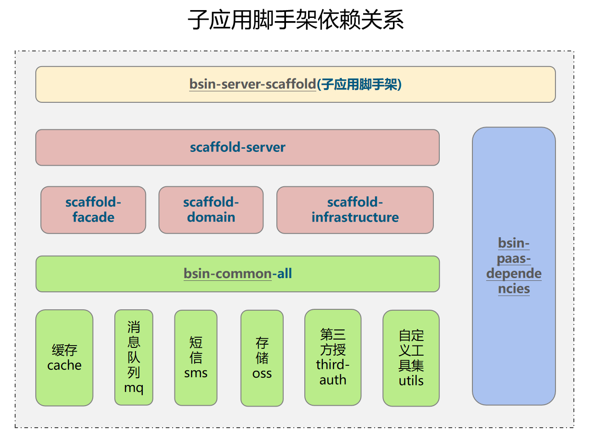
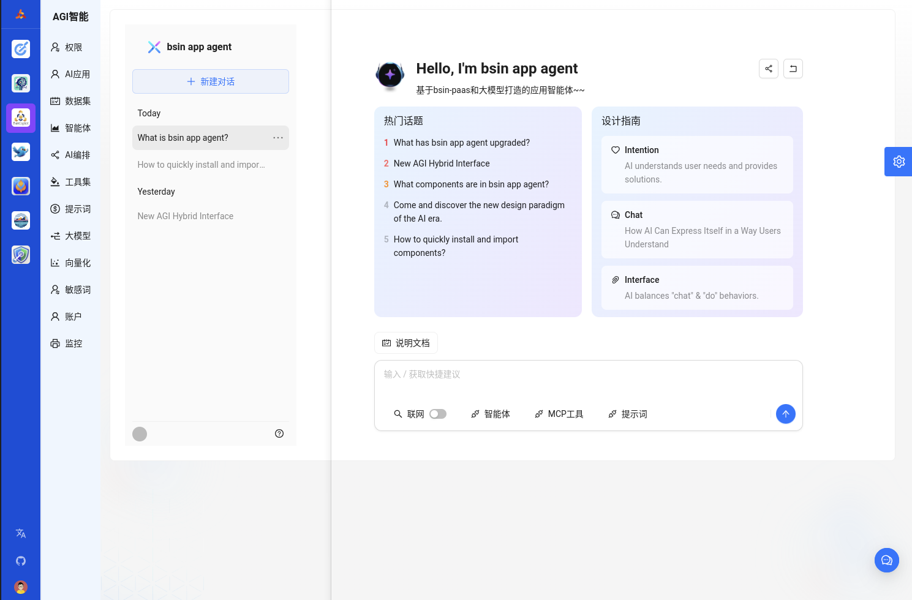
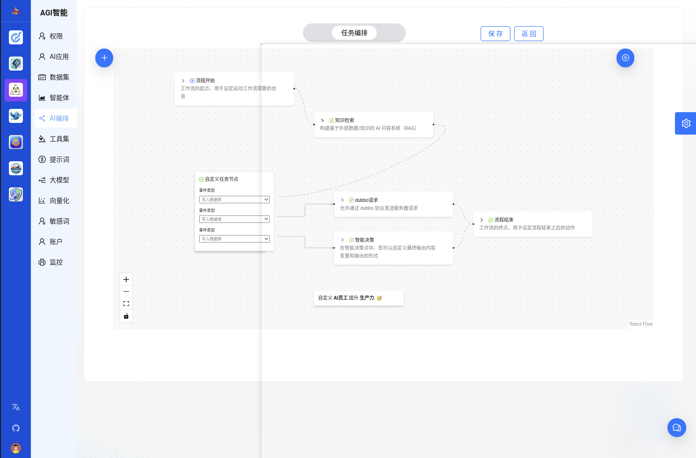

# 区块链低代码开发平台
[toc]

## 开源项目介绍
Bsin-PaaS（毕昇） 是一套企业级的低代码、零代码去中心化应用搭建平台，可帮助企业快速搭建基于云原生的有竞争力的业务中台、流程中台、业务前台。bsin-paas包括微前端设计、微服务框架、服务编排、工作流引擎、安全网关及区块链引擎。该方案由区块链(公链、联盟链)作为技术支撑,为企业提供daPaaS层的一站式解决方案，助力企业打造数字经济底层技术架构，构建一套开放式和生态化的技术体系。作为一个平台，Bsin-PaaS本身拥有自己的数字资产，以用户为中心，实现让价值掌握在拥有者手中，帮企业构建一种全新的商业生态模式。

## 2.0版本新特性：
* 全新的网关
* restfull风格的API
* 全新的项目结构
* 乐高似的模块化设计
* 全新的UI升级
* 全新的分布式定时任务
* 适配ob分布式数据库

## 产品优势：
* 开箱即用
* 生态应用独立开发、部署、运行
* 生态应用丰富：配套丰富的企业级业务应用，生态应用持续完善
* 产品持续迭代
* 数字经济底座

## 设计理念
* 统一企业技术路线
* 统一数字企业IT架构
* 统一企业开发流程
* 统一开发资源库

## 数字化转型三部曲
> bsin-paas 可以快速用于搭建企业技术中台


## 项目演示

>bsin-paas平台 租户:bsin-paas 账户:admin 123456
```
http://operation.flyray.me/
演示环境暂时无法访问


```
> 演示视频

https://www.bilibili.com/video/BV1VM4y1a7PF/?vd_source=360ae092de70c0b6c577d1d26f3565fe

## 平台定位
提供daPaaS层的一站式企业级技术解决方案，帮助企业快速实现商业创新，完成数字化转型。

## 理念
为经营者谋发展，为消费者权益，为投资者谋财富
共创价值 共享价值

## 平台总架构设计


## 平台架构基于DDD设计理念


## 区块链应用架构


## 基于大语言模型的AI应用架构图


## 应用业务流程视图


## 业务能力示意图


## 商业版图


## bsin-paas定位


## bsin-paas-mvp


## 后端开发脚手架


## 前端开发脚手架


## 微前端设计


## 工程介绍

```
bsin-paas-all-in-one
├── bsin-paas-dependencies -- 系统全局maven依赖
├── bsin-common-all -- 系统公共模块
|    ├── bsin-common-blockchain -- 区块链工具类
|    ├── bsin-common-redis -- redis工具类
|    ├── bsin-common-mq -- 消息队列工具类
|    ├── bsin-common-oss -- 对象存储工具类
|    ├── bsin-common-payment -- 支付工具类
|    ├── bsin-common-sms -- 短信工具类
|    ├── bsin-common-third-auth -- 第三方授权
|    ├── bsin-common-utils -- 基础工具类
|    └── bsin-common-security -- 安全工具类
├── bsin-targe-gateway -- 网关
├── bsin-targe-gateway-admin -- 网关管理后台
├── bsin-apps-container -- 微前端基座
├── bsin-server-apps -- 子应用后端（不同业务系统应用集）
|    ├── bsin-server-upms -- 通用权限管理
|    ├── bsin-server-waas -- 钱包即服务
|    ├── bsin-server-workflow -- 工作流引擎服务
|    ├── bsin-server-workflow-admin -- 工作流引擎管理
|    ├── bsin-server-intelligent-decision -- 智能决策引擎
|    ├── bsin-server-aiAgent -- AI引擎
|    └── bsin-server-orchestration -- 服务编排
├── bsin-ui-apps -- 子应用前端（不同业务系统应用集）
|    ├── bsin-ui-upms -- 通用权限管理
|    ├── bsin-ui-waas -- 钱包即服务
|    ├── bsin-ui-workflow-admin -- 工作流引擎管理
|    ├── bsin-ui-intelligent-decision -- 智能决策引擎
|    ├── bsin-ui-aiAgent -- AI引擎
|    └── bsin-ui-orchestration -- 服务编排
├── bsin-app-scaffold --  c端应用脚手架
|    ├── bsin-app-minApp -- 小程序脚手架
|    ├── bsin-app-android -- android脚手架
|    └── bsin-app-ios -- ios脚手架
├── bsin-server-scaffold -- 后端开发脚手架
|    ├── bsin-server-scaffold-sofa -- sofa脚手架
|    ├── bsin-server-scaffold-dubbo -- dubbo脚手架
|    └── bsin-server-scaffold-spring-cloud -- spring-cloud脚手架
└── bsin-ui-scaffold -- 前端开发脚手架
     ├── bsin-ui-vue -- vue脚手架
     └── bsin-ui-react -- react脚手架
```

## Bsin-PaaS 后端仓库项目介绍
|              项目名称               | 是否开源 |                                     仓库地址                                     | 功能简介                                     |
|:-------------------------------:|:----:|:----------------------------------------------------------------------------:|:-----------------------------------------|
|     bsin-server-common-all      |  是   |   [bsin-paas-all-in-one](https://gitee.com/s11e-DAO/bsin-paas-all-in-one)    | Bsin-PaaS 公共工具、库                         |
|    bsin-server-targe-gateway    |  是   |   [bsin-paas-all-in-one](https://gitee.com/s11e-DAO/bsin-paas-all-in-one)    | Bsin-PaaS 网关                             |
|        bsin-server-upms         |  是   |   [bsin-paas-all-in-one](https://gitee.com/s11e-DAO/bsin-paas-all-in-one)    | Bsin-PaaS 权限管理                           |
|      bsin-server-workflow       |  是   |   [bsin-paas-all-in-one](https://gitee.com/s11e-DAO/bsin-paas-all-in-one)    | Bsin-PaaS 工作流                            |
|   bsin-server-workflow-admin    |  是   |   [bsin-paas-all-in-one](https://gitee.com/s11e-DAO/bsin-paas-all-in-one)    | Bsin-PaaS 工作流后台管理                        |
|     bsin-server-intelligent     |  是   |   [bsin-paas-all-in-one](https://gitee.com/s11e-DAO/bsin-paas-all-in-one)    | Bsin-PaaS 智能决策引擎                         |
|         bsin-server-env         |  是   |        [bisn-server-env](https://gitee.com/s11e-DAO/bisn-server-env)         | Bsin-PaaS 后台服务环境，seata、zookeepe、maven软件包 |
|         bsin-server-ai          |  是   |    [bsin-server-ai](https://gitee.com/s11e-DAO/bsin-server-ai)               | Bsin-PaaS 通用人工智能后台                       |
|    bsin-server-web3-ability     |  否   | [bsin-paas-all-in-one](https://gitee.com/s11e-DAO/bsin-server-web3-ability)  | Bsin-PaaS web3应用能力平台                     |
|     bsin-server-blockchain      |  否   | [bsin-server-blockchain](https://gitee.com/s11e-DAO/bsin-server-blockchain)  | Bsin-PaaS 区块链公链适配器                       |
| bsin-server-web3-orchestration  |  否   | [bsin-paas-all-in-one](https://gitee.com/s11e-DAO/bsin-server-orchestration) | Bsin-PaaS 服务编排前段                         |
|      bsin-server-scaffold       |  是   |   [bsin-server-scaffold](https://gitee.com/s11e-DAO/bsin-server-scaffold)    | Bsin-Paas 后端原子服务应用开发脚手架                  |
|       bsin-bigan-sdk-java       |  否   |    [bsin-bigan-sdk-java](https://gitee.com/s11e-DAO/bsin-bigan-sdk-java)     | Bsin-Paas 后端原子服务应用开发脚手架                  |


## Bsin-PaaS 前端仓库项目介绍
|              项目名称              |   是否开源    |                                            仓库地址                                             | 功能简介                                                 |
|:------------------------------:|:---------:|:-------------------------------------------------------------------------------------------:|:-----------------------------------------------------|
|       bsin-ui-container        |     是     |           [bsin-paas-all-in-one](https://gitee.com/s11e-DAO/bsin-paas-all-in-one)           | Bsin-PaaS应用基座前端                                      |
|          bsin-ui-upms          |     是     |           [bsin-paas-all-in-one](https://gitee.com/s11e-DAO/bsin-paas-all-in-one)           | Bsin-PaaS权限管理后台子应用前端                                 | 
|     bsin-ui-orchestration      |     否     |          [bsin-ui-orchestration](https://gitee.com/s11e-DAO/bsin-ui-orchestration)          | Bsin-PaaS服务编排前段后台子应用前端                               | 
|  bsin-ui-intelligent-decision  |     否     |      [bsin-ui-orchestration](https://gitee.com/s11e-DAO/bsin-ui-intelligent-decision)       | Bsin-PaaS智能决策引擎                                      |
|        bsin-ui-daobook         |     否     |                [bsin-ui-daobook](https://gitee.com/s11e-DAO/bsin-ui-daobook)                | Bsin-PaaS dapbook后台管理后台子应用前端                         |
|           bsin-ui-ai           |     否     |                     [bsin-ui-ai](https://gitee.com/s11e-DAO/bsin-ui-ai)                     | Bsin-PaaS 通用人工智能管理子应用前端                              |
|          bsin-ui-dapp          |     否     |                   [bsin-ui-dapp](https://gitee.com/s11e-DAO/bsin-ui-dapp)                   | web3 Dapp开发脚手架，集成钱包管理、智能合约交、NFT画廊等等                  |
|        bsin-ui-merchant        |     否     |               [bsin-ui-merchant](https://gitee.com/s11e-DAO/bsin-ui-merchant)               | bigan产品的h5活动领取页面                                     |
|        bsin-ui-bigan-h5        |     否     |               [bsin-ui-bigan-h5](https://gitee.com/s11e-DAO/bsin-ui-bigan-h5)               | bigan SaaS服务                                         |
|      bsin-minapp-merchant      |     否     |           [bsin-minapp-merchant](https://gitee.com/s11e-DAO/bsin-minapp-merchant)           |                                                      |
|       bsin-minapp-baigui       |     否     |            [bsin-minapp-merchant](https://gitee.com/s11e-DAO/bsin-minapp-baigui)            | Baigui是dao的nft发行流通工具，属于daobook内置模块。                  |
|    bsin-minapp-daobook-task    |     是     |       [bsin-minapp-daobook-task](https://gitee.com/s11e-DAO/bsin-minapp-daobook-task)       | 治理工具：daobook                                         |
|     bsin-minapp-huajianmo      |     否     |          [bsin-minapp-huajianmo](https://gitee.com/s11e-DAO/bsin-minapp-huajianmo)          | 云电商 uniCloud 版                                       |
|  bsin-minapp-huajianmo-admin   |     否     |    [bsin-minapp-huajianmo-admin](https://gitee.com/s11e-DAO/bsin-minapp-huajianmo-admin)    | 云电商 uniCloud 版                                       |
|       bsin-minapp-wallet       |     否     |             [bsin-minapp-wallet](https://gitee.com/s11e-DAO/bsin-minapp-wallet)             |                                                      |
|   bsin-minapps-container-ios   |     否     |     [bsin-minapp-container-ios](https://gitee.com/s11e-DAO/bsin-minapps-container-ios)      | 原生ios APP壳应用，可容纳各种小程序应用，提供极致的h5用户体验，帮助企业打造超级应用生态     |
| bsin-minapps-container-android |     否      | [bsin-minapps-container-android](https://gitee.com/s11e-DAO/bsin-minapps-container-android) | 原生android APP壳应用，可容纳各种小程序应用，提供极致的h5用户体验，帮助企业打造超级应用生态 |
|       bsin-ui-umi4-demo        |     是     |              [bsin-ui-umi4-demo](https://gitee.com/s11e-DAO/bsin-ui-umi4-demo)              | 基于react umi wagmi和Web3UIKit和Material UI的dapp demo应用  |
|         bsin-paas-doc          |     是     |                 [bsin-paas-help](https://gitee.com/s11e-DAO/bsin-paas-help)                 | Bsin 帮助文档中心                                          |
|      bsin-ui-huoyuanshequ      |     否     |           [bsin-ui-huoyuanshequ](https://gitee.com/s11e-DAO/bsin-ui-huoyuanshequ)           | 火源社区官网论坛                                             |
|  bsin-ui-scaffold-react-app1   |     是     |    [bsin-ui-scaffold-react-app1](https://gitee.com/s11e-DAO/bsin-ui-scaffold-react-app1)    | Bsin-PaaS react开发脚手架                                 |
|     bsin-ui-scaffold-vue3      |     是     |          [bsin-ui-scaffold-vue3](https://gitee.com/s11e-DAO/bsin-ui-scaffold-vue3)          | Bsin-PaaS Vu3开发脚手架                                   |
|     bsin-ui-scaffold-vue2      |     是     |          [bsin-ui-scaffold-vue2](https://gitee.com/s11e-DAO/bsin-ui-scaffold-vue2)          | Bsin-PaaS Vu2开发脚手架                                   |


## Bsin-PaaS 智能合约仓库项目工程介绍
|        项目名称         |    是否开源     |                            仓库地址                             | 功能简介                                                                                                                                                                                                  |
|:-------------------:|:-----------:|:-----------------------------------------------------------:|:------------------------------------------------------------------------------------------------------------------------------------------------------------------------------------------------------|
|    s11e-protocol    |    即将开源     |  [s11e-protocol](https://gitee.com/s11e-DAO/s11e-protocol)  | s11e Protocol是部署在conflux公链上的dao治理协议，作为daobook(DAO治理服务平台)的智能合约接口服务，KOL使用daobook能够简单快速地启动dao，发行管理dao数字资产，使用链上地址进行身份验证，根据成员的的数字积分和SBT进行提案、任务、选举的投票治理和权益的记录和追溯，在保障去中心化和平权的同时，实现对协同的赋能和约束以及公正透明的量化每个成员的贡献。 |
|   fire-beast-pfp    |    即将开源     | [fire-beast-pfp](https://gitee.com/s11e-DAO/fire-beast-pfp) | s11eDao 火源兽PFP智能合约及官网DAPP                                                                                                                                                                             |
|      huajianmo      |    即将开源     |      [huajianmo](https://gitee.com/s11e-DAO/huajianmo)      | 花尖墨web3共创品牌官网dapp                                                                                                                                                                                     |


> 帮助文档
* http://help.flyray.me

## bsin-paas总体规划


## UI展示
* 登录页


* 首页工作台


* 主题设置


* 新主题工作台


* 菜单主题


* 菜单主题上


* 权限管理


* 工作流引擎


* 工作流画布


* 智能决策引擎


* 服务编排


* 服务编排画布


* 通用人工智能


* AI员工.png


  

* bsin-bot低代码平台


* 数字资产管理平台


* 数据大屏


* react 不同子应用相互嵌套展示


## 开源协议

apache license 2.0

* 允许免费用于学习.
* 商业用途需要授权.
* 对未经过授权进行二次开源或者商业化的将追究法律责任.

## 文章署名格式
>#本文作者#
> s11eDao

## 项目团队
Bsin-PaaSDAO是一个围绕Bsin-PaaS开源框架，以技术驱动，以共建、共治、共享为理念的DAO组织，主要任务是持续迭代Bsin-PaaS框架，为企业提供商业化服务，实现企业的降本增效

s11eDAO是一个专注于Web3.0商业构建的数字化社区。社区拥有NFT徽章体系、联合曲线数字积分和独特的DAO治理经济模型。社区旨在做一款有温度的工具，帮助实体品牌实现Web3.0，为实体品牌提供一站式的Web3.0品牌构建服务。
## 技术交流

加微信小助手入群


微信公众号


