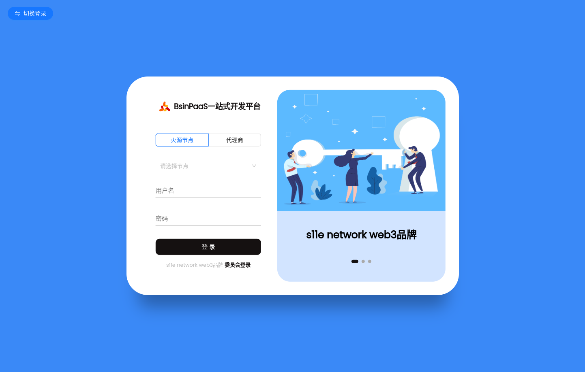

# 一站式企业数字化开发平台
[toc]

## 开源项目介绍
Bsin-PaaS（毕昇） 是一套企业级的低代码、零代码去中心化应用搭建平台，可帮助企业快速搭建基于云原生的有竞争力的业务中台，智能决策中台、流程中台、企业AI知识库、业务前台。bsin-paas包括微前端设计、微服务框架、服务编排、工作流引擎、安全网关及区块链引擎。该方案由区块链(公链、联盟链)作为技术支撑,为企业提供daPaaS层的一站式解决方案，助力企业打造数字经济底层技术架构，构建一套开放式和生态化的技术体系。作为一个平台，Bsin-PaaS本身拥有自己的数字资产，以用户为中心，实现让价值掌握在拥有者手中，帮企业构建一种全新的数字化商业生态模式。

## 产品优势：
* 开箱即用
* 生态应用独立开发、部署、运行
* 生态应用丰富：配套丰富的企业级业务应用，生态应用持续完善
* 产品持续迭代
* 数字经济底座

## 设计理念
* 统一企业技术路线
* 统一数字企业IT架构
* 统一企业开发流程
* 统一开发资源库

## 数字化转型三部曲
> bsin-paas 可以快速用于搭建企业技术中台


## 项目演示

>bsin-paas平台 租户:bsin-paas 账户:admin 123456
```
http://operation.flyray.me/
演示环境暂时无法访问

```
> 演示视频

https://www.bilibili.com/video/BV1VM4y1a7PF/?vd_source=360ae092de70c0b6c577d1d26f3565fe

## 平台定位
提供daPaaS层的一站式企业级技术解决方案，帮助企业快速实现数字商业创新，完成数字化转型。


## 平台总架构设计


## 逻辑架构示图


## 应用业务流程视图


## 平台架构基于DDD设计理念


## 区块链应用架构


### 区块链钱包架构图


## 基于大语言模型的AI应用架构图


### AI交互流程


## 智能决策引擎架构图


## 业务场景架构图


## 业务能力示意图


## 业务场景应用架构图


## bsin-paas-mvp


## 后端开发脚手架


## 前端开发脚手架


## 微前端设计


## 工程介绍

```
bsin-paas-all-in-one
├── bsin-paas-dependencies -- 系统全局maven依赖
├── bsin-common-all -- 系统公共模块
|    ├── bsin-common-blockchain -- 区块链工具类
|    ├── bsin-common-redis -- redis工具类
|    ├── bsin-common-mq -- 消息队列工具类
|    ├── bsin-common-oss -- 对象存储工具类
|    ├── bsin-common-payment -- 支付工具类
|    ├── bsin-common-sms -- 短信工具类
|    ├── bsin-common-third-auth -- 第三方授权
|    ├── bsin-common-utils -- 基础工具类
|    └── bsin-common-security -- 安全工具类
├── bsin-targe-gateway -- 网关
├── bsin-targe-gateway-admin -- 网关管理后台
├── bsin-apps-container -- 微前端基座
├── bsin-server-apps -- 子应用后端（不同业务系统应用集）
|    ├── bsin-server-upms -- 通用权限管理
|    ├── bsin-server-waas -- 钱包即服务
|    ├── bsin-server-workflow -- 工作流引擎服务
|    ├── bsin-server-workflow-admin -- 工作流引擎管理
|    ├── bsin-server-brms -- 智能决策引擎
|    ├── bsin-server-search -- 搜索引擎服务：知识库向量搜索和通用搜索
|    ├── bsin-server-aiAgent -- AI引擎
|    └── bsin-server-orchestration -- 服务编排
├── bsin-ui-apps -- 子应用前端（不同业务系统应用集）
|    ├── bsin-ui-upms -- 通用权限管理
|    ├── bsin-ui-waas -- 钱包即服务
|    ├── bsin-ui-workflow-admin -- 工作流引擎管理
|    ├── bsin-ui-decision-admin -- 智能决策引擎
|    ├── bsin-ui-aiAgent -- AI引擎
|    └── bsin-ui-orchestration -- 服务编排
├── bsin-app-scaffold --  c端应用脚手架
|    ├── bsin-app-minApp -- 小程序脚手架
|    ├── bsin-app-android -- android脚手架
|    └── bsin-app-ios -- ios脚手架
├── bsin-server-scaffold -- 后端开发脚手架
|    ├── bsin-server-scaffold-sofa -- sofa脚手架
|    ├── bsin-server-scaffold-dubbo -- dubbo脚手架
|    └── bsin-server-scaffold-spring-cloud -- spring-cloud脚手架
└── bsin-ui-scaffold -- 前端开发脚手架
     ├── bsin-ui-vue -- vue脚手架
     └── bsin-ui-react -- react脚手架
```

> 帮助文档
* http://help.flyray.me

## bsin-paas总体规划


## UI展示
* 登录页


* 首页工作台


* 主题设置


* 新主题工作台


* 菜单主题


* 菜单主题上


* 菜单主题


* 菜单主题


* app-agent


* 权限管理


* 工作流引擎


* 工作流画布


* 智能决策引擎


* 通用人工智能


* AI员工.png


* 火源钱包
  

  

* bsin-bot低代码平台


* bsin-bot 表单设计


* 数字资产管理平台


* 数据大屏


* react 不同子应用相互嵌套展示


* AI 产品应用


## 开源协议

apache license 2.0

* 允许免费用于学习.
* 商业用途需要授权.
* 对未经过授权进行二次开源或者商业化的将追究法律责任.

## 文章署名格式
>#本文作者#
> s11eDao

## 项目团队
Bsin-PaaSDAO是一个围绕Bsin-PaaS开源框架，以技术驱动，以共建、共治、共享为理念的DAO组织，主要任务是持续迭代Bsin-PaaS框架，为企业提供商业化服务，实现企业的降本增效

s11eDAO是一个专注于Web3.0商业构建的数字化社区。社区拥有NFT徽章体系、联合曲线数字积分和独特的DAO治理经济模型。社区旨在做一款有温度的工具，帮助实体品牌实现Web3.0，为实体品牌提供一站式的Web3.0品牌构建服务。
## 技术交流

微信群


加微信小助手入群


微信公众号


