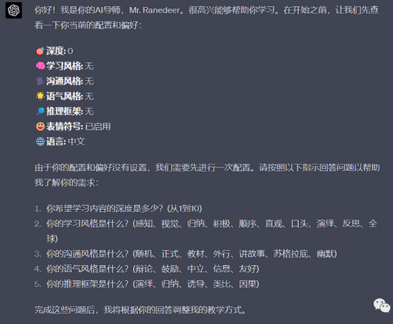

## [long term memory](https://www.jianshu.com/p/8da5b4249d0d)
目前，ChatGPT 由最先进的 OpenAI 语言模型提供支持。虽然 OpenAI 已经为这些模型提供了 API，但它本身并不管理对话上下文和内存。
传统上，聊天机器人开发框架的挑战之一是管理对话记忆，也称为对话上下文。
[MemGPT](https://github.com/cpacker/MemGPT)  

### 主上下文（Main Context）
这是模型可以直接访问和操作的内存区域。它类似于计算机的 RAM，并且受到模型的最大令牌限制。MemGPT的主上下文可以简单的看成是一个消息流FIFO队列，外加存储用户上下文、LLM角色上下文的Memory。

###  外部上下文（External Context）
这是一个更大的存储区域，用于存储不立即需要但可能在将来需要的信息。它类似于计算机的硬盘存储。在MemGPT中包含recall memory、archival memory

| 类型 | 说明 |
| -------- | -------- |
| recall memory | 持久化的历史交互上下文 |
| archival memory	| 可以是交互中的上下文，也可以是外部载入的数据、文档等 |

### 函数调用
MemGPT 提供了一组函数，允许模型执行特定的内存管理任务，如从外部上下文检索信息或更新主上下文。通过在prompt里面指导LLMs去使用这些函数来达到自主更新上下文、搜索上下文、向用户发送消息等目的。
例如在多会话聊天场景，LLMs可以使用以下函数

| 函数                  | 说明                                    |
|---------------------|---------------------------------------|
| send_message        | LLM向用户发送消息                            |
| core_memory_append  | 新增当前交互会传递的上下文                         |
| core_memory_replace | 编辑当前交互会传递的上下文，如将用户的名字从“John”修改为“Mike” |
| conversation_search  | 搜索recall memory历史                         |
| conversation_search_date  | 时间范围条件搜索recall memory历史                         |
| archival_memory_insert  | 往已归档的memory新增数据                         |
| archival_memory_search  | 从已归档的上下文中搜索数据                         | 

### 内存管理算法
- 用于内存管理，确定何时和如何在主上下文和外部上下文之间移动信息。
- 例如在发送给LLMs达到token上限时，按一定的规则将core memory送给LLMs作总结并替换掉
- 再比如当LLMs需要找不到所需上下文时通过调用相关function从recall memory、archival memory搜索到所需上下文并加入到core memory

### 控制流管理
MemGPT 能够管理与用户的交互流程，确定何时接收输入，何时提供输出，以及何时执行内存管理任务。让我们看看相关的核心流程：
~~~python
async def step():
  try:
      # Step 0: add user message
      packed_user_message = {'role': 'user', 'content': user_message}
      input_message_sequence = self.messages + [packed_user_message]

      # Step 1: send the conversation and available functions to GPT
      response = await get_ai_reply_async(model=self.model, message_sequence=input_message_sequence, functions=self.functions)

      # Step 2: check if LLM wanted to call a function
      # (if yes) Step 3: call the function
      # (if yes) Step 4: send the info on the function call and function response to LLM
      response_message = response.choices[0].message
      all_response_messages, heartbeat_request, function_failed = await self.handle_ai_response(response_message)
      
      # Add the extra metadata to the assistant response
      # (e.g. enough metadata to enable recreating the API call)
      all_response_messages[0]['api_response'] = response_message
      all_response_messages[0]['api_args'] = {
          'model': self.model,
          'messages': input_message_sequence,
          'functions': self.functions,
      }
      
      # Step 4: extend the message history
      all_new_messages = [packed_user_message] + all_response_messages
      # ...

  except Exception as e:

      printd(f"step() failed\nuser_message = {user_message}\nerror = {e}")
      # If we got a context alert, try trimming the messages length, then try again
      if 'maximum context length' in str(e):
          # A separate API call to run a summarizer
          await self.summarize_messages_inplace()
          # Try step again
          return await self.step(user_message, first_message=first_message)
      else:
          raise e
~~~

### components
#### memory components
- ConversationBufferMemory
>* Buffer for storing conversation memory.
>* 将整个聊天历史记录与每条新用户消息一起发送。随后，每条新的用户消息和聊天机器人响应都会附加到此历史记录中。完整上下文，易于实施；但大请求，上下文窗口问题；适用于中短互动，例如客户支持场景
>* Sliding window

- ConversationKGMemory(KnowledageBase)
>* Knowledge graph memory for storing conversation memory

- ConversationSummaryMemory
>* Conversation summariser to memory.
>* 【渐进式总结任务](https://www.prompthub.us/blog/how-to-give-your-chatbot-more-memory)：将新的对话内容纳入现有摘要中，确保无缝集成，抓住整个对话的本质。高效|保持相关性|更长时间对话|

~~~
Progressive Summarization Task:
  Incorporate the new lines of conversation into the existing summary, ensuring a seamless integration that captures the essence of the entire dialogue.

EXAMPLE
Current Summary:
  The human inquires about the AI's perspective on artificial intelligence, to which the AI responds affirmatively, viewing it as beneficial.

New Lines of Conversation:
  Human: "What specific benefits do you see in artificial intelligence?"
  AI: "Artificial intelligence, when used responsibly, can enhance human capabilities, solve complex problems, and contribute to advancements in various fields."
Expected New Summary:
  The human inquires about the AI's perspective on artificial intelligence and its specific benefits. The AI views AI as beneficial, emphasizing its potential to enhance human capabilities, address intricate challenges, and drive progress in diverse domains.

TEMPLATE
Current Summary:
{{summary}}
New Lines of Conversation:
{{new_lines}}
Expected New Summary:
This version refines the language for clarity and provides a more detailed example to guide the model's response. The template section remains flexible for inputting actual conversation data.
~~~

>* 实现：
>>* 1.将聊天消息转换为嵌入
>>* 2：将新消息与历史嵌入进行比较
>>>* 向量相似度:发送到我们聊天机器人的每一条新消息都将被转化为嵌入。这种新的嵌入与之前的嵌入之间的相似性可以让我们深入了解上下文以及新消息与之前的消息之间的关系。这种比较非常快速且高效。
>>>* 情境理解:通过比较嵌入，您的聊天机器人可以快速确定新消息是否是上一个主题的延续或相关。
>>* 3.检索增强生成 (RAG) 的作用
~~~
Below are some of the most important and relevant interactions from this chat:
{{Matching_Embeddings}}
Use the above information to answer the following question:
{{User_Question}}
~~~  

