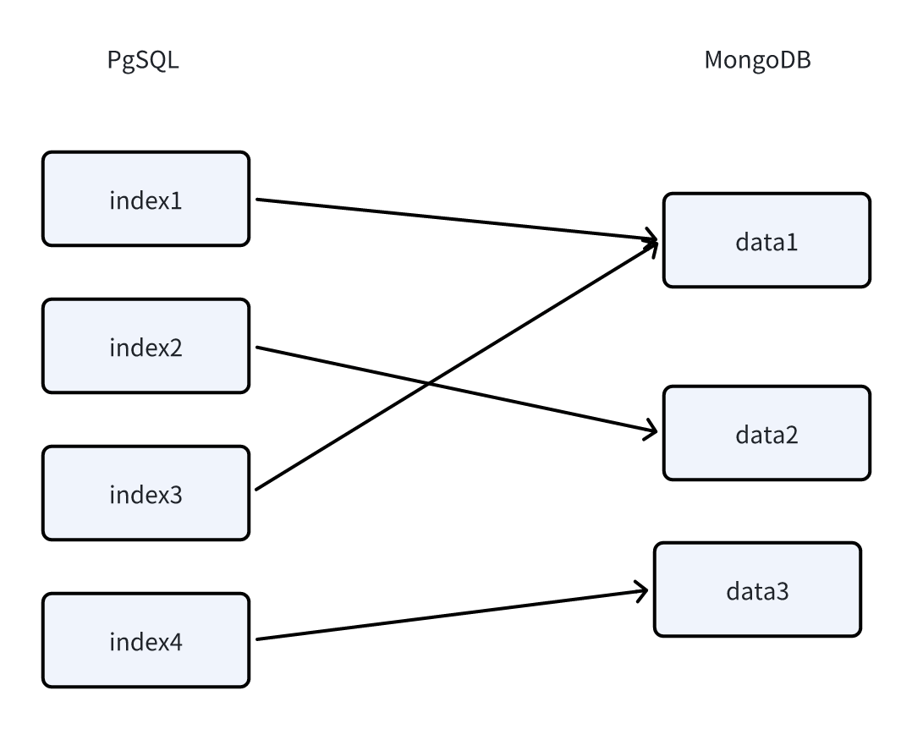

## 知识库结构讲解
### 向量
- 人类的文字、图片、视频等媒介是无法直接被计算机理解的，要想让计算机理解两段文字是否有相似性、相关性，通常需要将它们转成计算机可以理解的语言，向量是其中的一种方式。 
- 向量可以简单理解为一个数字数组，两个向量之间可以通过数学公式得出一个距离，距离越小代表两个向量的相似度越大。从而映射到文字、图片、视频等媒介上，可以用来判断两个媒介之间的相似度。向量搜索便是利用了这个原
- 而由于文字是有多种类型，并且拥有成千上万种组合方式，因此在转成向量进行相似度匹配时，很难保障其精确性。在向量方案构建的知识库中，通常使用topk召回的方式，也就是查找前k个最相似的内容，丢给大模型去做更进一步的语义判断、逻辑推理和归纳总结，从而实现知识库问答。因此，在知识库问答中，向量搜索的环节是最为重要的。
- 影响向量搜索精度的因素非常多，主要包括：向量模型的质量、数据的质量（长度，完整性，多样性）、检索器的精度（速度与精度之间的取舍）。与数据质量对应的就是检索词的质量。  
- 检索器的精度比较容易解决，向量模型的训练略复杂，因此数据和检索词质量优化成了一个重要的环节。  

### 向量的结构设计
- Bsin-Copilot 采用了 Milvus 向量数据库作为向量存储和检索，MySQL用于其他数据的存取。
- 在MySQL的dataset.datas表中，会存储向量原数据分段后的的信息，同时有一个VectorIndex字段，会记录其对应的向量ID，这是一个数组，也就是说，一组向量可以对应多组数据。
- 在Milvus的表和字段设计如下，设置一个 vector 字段用于存储向量。
- 一个Tenant创建一个库-database
>* 两个collection：merchantCollection和customerCollection
>* merchantCollection字段设计

|  id |  customers_no |  knowledge_base_no |  knowledge_base_file_no | chunkNo | text |vector  |
|  ----  | ----  | ----  | ----  |---------| ----  | ----  |
| 主键  | 商戶ID | 绑定的知识库ID | 绑定的知识库文件ID | chunk索引 | chunk后的文本   | 向量数据 |

>* customerCollection 字段设计

|  id |  customers_no |  knowledge_base_no |  knowledge_base_file_no | chunkNo | text | vector |
|  ----  | ----  | ----  | ----  | ----  | ----  |--------|
| 主键  | 客戶ID | 绑定的知识库ID | 绑定的知识库文件ID | chunk索引 | chunk后的文本 | 向量数据 |

### 多向量的目的和使用方式
- 在一组向量中，内容的长度和语义的丰富度通常是矛盾的，无法兼得。因此，FastGPT 采用了多向量映射的方式，将一组数据映射到多组向量中，从而保障数据的完整性和语义的丰富度。
- 你可以为一组较长的文本，添加多组向量，从而在检索时，只要其中一组向量被检索到，该数据也将被召回

### 提高向量搜索精度的方法
- 更好分词分段：当一段话的结构和语义是完整的，并且是单一的，精度也会提高。因此，许多系统都会优化分词器，尽可能的保障每组数据的完整性。
- 精简index的内容，减少向量内容的长度：当index的内容更少，更准确时，检索精度自然会提高。但与此同时，会牺牲一定的检索范围，适合答案较为严格的场景。
- 丰富index的数量，可以为同一个chunk内容增加多组index。
- 优化检索词：在实际使用过程中，用户的问题通常是模糊的或是缺失的，并不一定是完整清晰的问题。因此优化用户的问题（检索词）很大程度上也可以提高精度。
- 微调向量模型：由于市面上直接使用的向量模型都是通用型模型，在特定领域的检索精度并不高，因此微调向量模型可以很大程度上提高专业领域的检索效果

## 导入数据方案
### 直接分段导入
选择文件导入时，可以选择直接分段方案。直接分段会利用句子分词器对文本进行一定长度拆分，最终分割中多组的q。如果使用了直接分段方案，我们建议在应用设置引用提示词时，使用通用模板即可，无需选择问答模板。

### QA导入
选择文件导入时，可以选择QA拆分方案。仍然需要使用到句子分词器对文本进行拆分，但长度比直接分段大很多。在导入后，会先调用大模型对分段进行学习，并给出一些问题和答案，最终问题和答案会一起被存储到q中。注意，新版的 FastGPT 为了提高搜索的范围，不再将问题和答案分别存储到 qa 中

### 手动录入
在 FastGPT 中，你可以在任何一个集合中点击右上角的插入手动录入知识点，或者使用标注功能手动录入。被搜索的内容为q，补充内容(可选)为a。

### CSV录入
有些数据较为独特，可能需要单独的进行预处理分割后再导入 FastGPT，此时可以选择 csv 导入，可批量的将处理好的数据导入。

## 知识库搜索参数
### 语义检索
语义检索是通过向量距离，计算用户问题与知识库内容的距离，从而得出“相似度”，当然这并不是语文上的相似度，而是数学上的。
- 优点
>* 相近语义理解
>* 跨多语言理解（例如输入中文问题匹配英文知识点）
>* 多模态理解（文本，图片，音视频等）
- 确定
>* 依赖模型训练效果
>* 精度不稳定
>* 受关键词和句子完整度影响

### 全文检索
采用传统的全文检索方式。适合查找关键的主谓语等。 

### 混合检索
同时使用向量检索和全文检索，并通过 RRF 公式进行两个搜索结果合并，一般情况下搜索结果会更加丰富准确。  
由于混合检索后的查找范围很大，并且无法直接进行相似度过滤，通常需要进行利用重排模型进行一次结果重新排序，并利用重排的得分进行过滤。  

### 结果重排
用ReRank模型对搜索结果进行重排，绝大多数情况下，可以有效提高搜索结果的准确率。不过，重排模型与问题的完整度（主谓语齐全）有一些关系，通常会先走问题补全后再进行搜索-重排。重排后可以得到一个0-1的得分，代表着搜索内容与问题的相关度，该分数通常比向量的得分更加精确，可以根据得分进行过滤。
使用 RRF 对重排结果、向量搜索结果、全文检索结果进行合并，得到最终的搜索结果。
