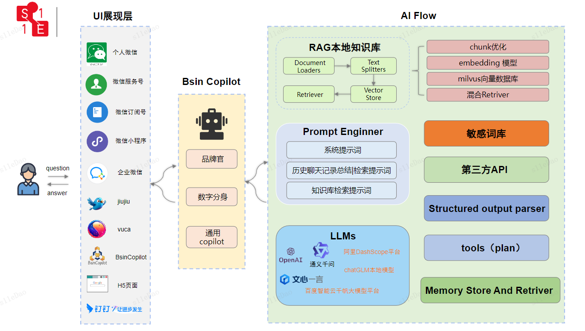

BsinCopilot是基于[BsinPaaS开源框架](https://gitee.com/s11e-DAO/bsin-paas-all-in-one)构建的大语言模型应用SaaS服务，借鉴langchain的框架思想，引入langchian4j组件，微前端微服务的架构设计，可快速助您构建和体验端到端的AI应用。  
🤖 在线使用：http://copilot.s11edao.com

**文档版本**

| 版本号 | 修改日期       | 编写   | 修改内容           | 备注 |
| ------ |------------| ------ |----------------| ---- |
| V1.0.0 | 2023/04/21 | leonard | 新建             |      |
| V1.0.0 | 2024/02/05 | leonard | bsin-copilot初稿 |      |


# 相关术语

| 序号 | 术语/缩略语    | 全称和说明                                                                                                                            |
|----|-----------|----------------------------------------------------------------------------------------------------------------------------------|
| 1  | Bsin      | 毕昇缩写，毕昇，中国北宋发明家，活字印刷术的发明者。毕昇出身平民，长期在杭州书籍铺做雕版刻工，专事手工印刷。在雕版印刷实践中，鉴于雕版印刷的艰难，为减少成本、提高排版效率，其在总结前人经验的基础上，发明了活字印刷术                      |
| 2  | PaaS      | Platform as a Service的缩写，是指平台即服务。                                                                                                |
| 2  | aPaaS     | Application Platform as a Service,是应用程序平台即服务的缩写，它是一种云服务，可为应用程序服务提供开发和部署环境。aPaaS平台提供了以下功能：迭代构建应用程序、即时提供应用软件、按需扩展应用程序以及集成应用程序与其他服务 |
| 3  | LLM       | 大语言模型（Large Language Model），是一种基于深度学习的自然语言处理技术，可以生成和理解人类语言文本，它可以应用于自然语言处理领域中的多种任务，如文本生成、文本理解、问答系统、机器翻译等                          |
| 4  | Embedding |                                                                                                                                  |


# 技术栈
## 大语言模型后台(java)：本地知识库(RAG)、大语言模型管理、AI服务编排...
| 组件              | 版本     | 备注                                                   |
|-----------------|--------|------------------------------------------------------|
| JDK             | 11+    |                                                      |
| SOFABoot        | 3.18.0 | 蚂蚁金服开源的基于 Spring Boot 的研发框架                          |
| zookeeper       | 3.6.2  | 分布式的，开放源码的分布式应用程序协调服务                                |
| seata           | 1.4.2  | 分布式事务解决方案，致力于在微服务架构下提供高性能和简单易用的分布式事务服务               |
| MySql           | 8.0    | 关系型数据库                                               |
| Redis           | 6.0.16 | 缓存                                                   |
| Milvus          | 2.3.5  | 一款开源的向量数据库，旨在提供高效的相似性搜索和向量聚类功能，本地知识库，永久Copilot记忆存储   |
| BsinPaaS        | 1.0    | 企业级微服务框架                                             |
| Mybatis         | 2.1.3  | MySQL数据持久层(ORM)框架                                    |
| langchain4j     | 0.27.1 | java版本的langchain                                     |
| wx-java         | 4.3.0  | 基于Java语言的微信开发Java SDK,它提供了微信支付,开放平台,小程序,企业微信,公众号等多个平台的API接口 |
| ...             |        |                                                      |

## 后端(golang)-主要实现个人微信登录及消息转发
| 组件         | 版本      | 备注                        |
|------------|---------|---------------------------|
| gin        | 1.9.1   | 轻量级 http web 框架           |
| openWechat | 1.4.6   | 个人微信号API,类似开发公众号一样,开发个人微信号 |
| go-redis   | 9.4.0   | 缓存                        |
| swag       | 1.8.12  | 接口文档生成                    | 
| ...             |        |                                                      |

## 前端(B端后台管理)
| 组件                          | 版本      | 备注                                                        |
|-----------------------------|---------|-----------------------------------------------------------|
| bsin-apps-container         | 2.0.0   | BsinPaaS微前端基座UI                                           |
| bsin-ui-upms                | 2.0.0   | BsinPaaS权限管理后台UI                                          |
| bsin-ui-scaffold-react-app1 | 2.0.0   | BsinPaaS微前端后台管理脚手架                                        |
| react                       | 18.1.0  | Facebook开源前端框架                                            |
| antd                        | 5.4.7   | 基于Ant Design设计体系的React UI组件库,主要用于研发企业级中后台产品               | 
| umi                         | 2.10.1  | 可扩展的企业级前端应用框架                                             |
| qiankun                     | 4.0.72  | 基于 single-spa 的微前端实现库，旨在帮助大家能更简单、无痛的构建一个生产可用微前端架构系统       |
| reactflow                   | 11.10.3 | 基于React的可视化工作流库,它提供了丰富的功能和灵活的扩展性,可以帮助开发者快速构建出高质量的可视化工作流应用 |
| ant-design/pro-chat         | 1.7.0   | 基于Ant Design大模型聊天组件                                       |
| ...             |        |                                                      |


## 前端(C端app|h5|小程序)
| 组件                      | 版本    | 备注                                                         |
|-------------------------|-------|------------------------------------------------------------|
| bsin-ui-scaffold-uniapp | 1.0.0 | BsinPaaS uni-app微前端脚手架                                     |
| uni-app                 |       | 使用Vue.js开发跨平台个人文库应用的前端框架，开发者编写一套代码，可编译到的iOS，安卓，H5，小程序等多个平台 | 
| ...             |        |                                                      |


# 架构设计


# 功能
bsin-copilot基于BsinPaaS开发，除了BsinPaaS自带的多租户多商户多用户权限管理，菜单管理等基础功能外，集成了丰富的大语言模型应用通用基础组件，并可通过后台管理配置所有功能，集合AI高级编排功能，可快速构建垂直领域的AI应用。如数字分身(数字人)，企业品牌馆，客服助手等等。
## 一、LLMs
- [ ] 主流 LLM 模型支持
  - [x] [OPENAI](https://platform.openai.com/docs/api-reference)
  - [x] [THUDM/chatglm2-6b](https://huggingface.co/THUDM/chatglm2-6b)
  - [x] [百度/文心一言](https://cloud.baidu.com/doc/WENXINWORKSHOP/s/clntwmv7t)
  - [ ] [THUDM/chatglm-6b](https://huggingface.co/THUDM/chatglm-6b)

## 二、Embeddings
- [ ] 主流 Embedding 模型支持
  - [x] [OPENAI/embedding](https://platform.openai.com/docs/api-reference/embeddings)
  - [x] [weaviate/text2vec-transformers](https://weaviate.io/developers/weaviate/modules/retriever-vectorizer-modules/text2vec-transformers)
  - [x] [百度/文心一言](https://cloud.baidu.com/doc/WENXINWORKSHOP/s/dllz04sro)
  - [ ] [shibing624/text2vec-base-chinese](https://huggingface.co/shibing624/text2vec-base-chinese)


## 三、提示词模版 


## 四、敏感词过滤
系统自带设计宗教、政治、颜色的敏感词过滤，同时用户可自己创建敏感词库


## 五、[OutputParsers](https://zhuanlan.zhihu.com/p/649185942?utm_id=0)
对聊天模型及其他模型输出结果的解析，因为理论上模型输出的结构都是字符串(如json格式的字符串),通过该模块可以将模型的输出按指定的格式输出，
比如json格式，boolean格式，也可以是自定的类结构格式。这样做主要是为了方便与生成应用交互。比如所有的模型输出都通过该模块转换成类结构输出，
那么上层应用就可以根据类结构获取对应的属性字段。类结构字段定义好之后，模型的调用和具体的上层应用就可以分离开，两者按定义好的中间数据层(类结构)独立开发，可以大大提升效率。


## 六、本地知识库
### 4.1 知识库roadMap
- [ ] 接入非结构化文档 
  - [x] markDown文档，.md
  - [x] pdf文档，.pdf
  - [x] docx文档，.docx
  - [x] txt文档，.txt
  - [ ] csv文档，.csv
  - 
- [ ] 搜索引擎接入
  - [ ] google
  - [ ] baidu
- [ ] 结构化数据接入 
  - [ ] Excel
  - [ ] SQL

- [ ] 知识图谱/图数据库接入，多模态
### 4.2 本地知识库RAG(Retriveval Generate Argument)设计方案
 

## 七、智能体
BsinCopilot中的智能体是与用户交互的最终表现形式，
- 对于品牌方来说，是一个品牌官，加载品牌的知识库，作为品牌宣传大使形象和人设，可以进一步保存与每一个用户的聊天记录，用于分析用户画像
- 对于个人使用而言，是一个元宇宙数字分身，可在元宇宙自动交友...

## 八、工具集
### 通用工具集

### 微信平台工具集

## 九、AI编排
[langFlow](https://cobusgreyling.medium.com/langflow-for-langchain-58c143ba9218)
copilot通过AI编排整合用户输入，知识库(archieval)Search，聊天上下文记录，ToolKits工具选择，APi接口调用，结构化数据整理等等功能

# 多租户多商户多用户管理
## 多租户管理

## 多商户管理

## 多用户管理

## 应用服务订阅


# quickStart


# 使用文档
[BsinCopilot用户手册](https://eeihz6cbu0.feishu.cn/docx/CLMQdupJbo7RuRxNWl7cMNDfnBb?theme=LIGHT&contentTheme=DARK)

# 视频教程
[BsinCopilot-打开微信扫一扫，登录您的微信AI分身](https://www.bilibili.com/video/BV1yJ4m1Y74G/?spm_id_from=333.1365.list.card_archive.click&vd_source=a6a847135c9dc5b402452069e1192313)
[Bsin-PaaS一分钟让公众号接入chatGPT智能客服](https://www.bilibili.com/video/BV14M4y1j7BS/?vd_source=a6a847135c9dc5b402452069e1192313)
[基于大语言模型的AI应用系统架构设计](https://www.bilibili.com/video/BV14M4y1j7BS/?vd_source=a6a847135c9dc5b402452069e1192313)

##  工作安装
```shell
启动向量数据库

docker-compose -f milvus-standalone-docker-compose.yml up -d

关闭向量数据库
sudo docker-compose -f milvus-standalone-docker-compose.yml down

查看向量数据库运行状态
docker-compose -f milvus-standalone-docker-compose.yml ps

向量数据库可视化工具
docker run -p 8000:3000  -e MILVUS_URL=127.0.0.1:19530 zilliz/attu:latest


```

