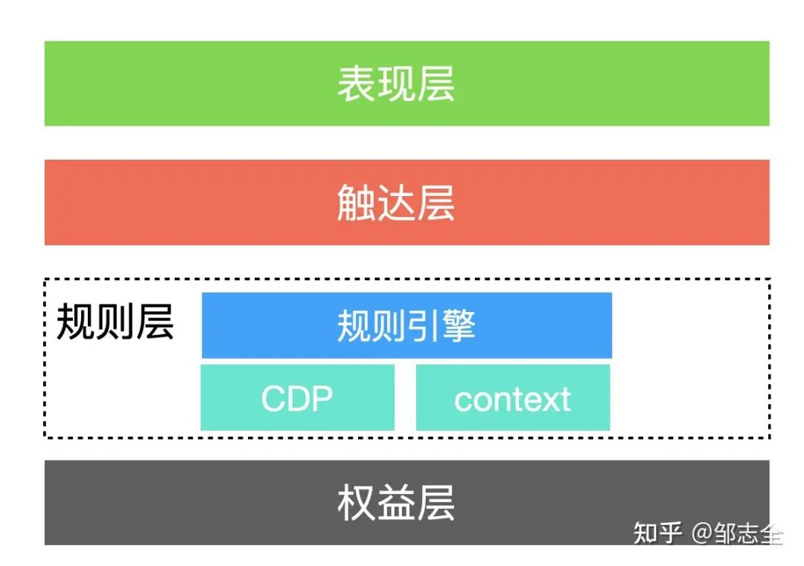

# bsin-server-Intelligent-decision

[toc]

#### 介绍
bsin-server-Intelligent-decision是基于drools和antv的自主研发的可视化智能决策引擎，也称规则引擎，帮助企业构建数字化运营体系

### 场景
* 实时营销等场景
* DAO组织激励规则配置
* web3品牌运营决策规则配置

### 特点
* 实时、准实时的决策模型配置
* 实时流数据驱动下
* 高并发、低延迟、高稳定性
* 可视化规则配置

### 关键设计点
* 一个事件对应多个模型：对于流程模型 规则模型 AI推理模型 表单模型等

#### 软件架构

#### 智能决策生命周期

### 决策示意图

* 表现层：完成界面的展示

* 触达层：完成玩法儿与用户的交互

* 规则层包括：各种玩法儿内部的规则&玩法儿之间的串联

* 权益层包括：

    ①权益类：NFT（门票、徽章、身份）、数字积分、各种券等；

    ②触达类：push、短信、私信等若干通知。

> 规则引擎使用场景：

① 抽奖，不同的人&不同的场景对应不同的奖池（不同的中奖概率、不同的奖品集合）；

② 任务，任务领取规则、任务完成指标动态可配（不同的人不同的任务，指标条件可动态配置&组合）；

③ 通用激励模型，不同的用户特征 对应不同的激励程度（不同的人在不同的场景下，对于奖励的感知程度都是不同的）；

④ 通用触达模型，差异化文案内容 分别具备不同的情感特征。

### 决策方法与流程

### 功能
#### 决策集
* 规则集指规则的集合，由三个部分规则组成：如果、那么、否则

#### 决策树
* 决策树其实就是if-then规则的集合

#### 决策表

* 决策表支持xls格式和csv格式(优先级低)

>学习文档
* https://juejin.cn/post/7103314419953713189

### 场景示意图
> 优惠场景

> 考虑一个优惠券计价场景
> 

### 概念

#### KnowledgeBuilder
* KnowledgeBuilder 的作用是用来在业务代码当中收集已经编写好的规则，然后对这些规则文件进行编译，最终产生一批编译好的规则包（KnowledgePackage）给其他的应用程序使用

#### Drools规则引擎
> Drools规则引擎由以下三部分构成：
* 1、Working Memory（工作内存，存放Fact-输入对象）
* 2、Rule Base（规则库，存放业务规则）
* 3、Inference Engine（推理引擎）

> 其中Interface Engine（推理引擎）包括：
* 1、Pattern Matcher（匹配器）
* 2、Agenda（议程，匹配成功的规则放入议程中）
* 3、Execution Engine（执行引擎）

* Working Memory：工作内存，Drools规则引擎会从工作内存中获取输入数据并和规则文件中定义的规则进行模式匹配，所以我们开发的应用程序只需要将我们的数据插入到Working Memory中即可。
例如上面案例中使用的：session.insert(order);就是将order对象插入到工作内存中。
* Fact：事实，是指在规则应用中，插入到Working Memory的对象便是Fact对象，例如上面案例中的order，作为应用与规则引擎的桥梁。
* Rule Base：规则库，定义在规则文件中的规则会被加载到规则库中进行weihu。
* Pattern Matcher：匹配器，将规则库中的所有规则与工作内存中的Fact进行模式匹配，匹配成功的规则将被放入议程Agenda中。
* Agenda：议程，用于存放匹配成功后被激活的规则。
* Execution Engine：执行引擎，执行议程中被激活的规则。

### drools API 开发步骤：
* ①获取KieServices
* ②获取KieContainer
* ③获取KieSession
* ④Insert fact（事实对象，接收数据的对象实体类）
* ⑤触发规则 fireAllrules()
* ⑥关闭KieSession

### drools语法
* https://juejin.cn/post/6844904040111800333

### 参考文档
* http://sjrzld.com/a/tan-yi-tan-gui-ze-yin-qing-zai-huo-dong-xi-tong-zhong-de-luo-di.html
* https://zhuanlan.zhihu.com/p/364546754
* https://zhuanlan.zhihu.com/p/140916822
* https://www.cnblogs.com/dubing/p/14919077.html
* https://www.xudj.top/archives/drools

### UI画布参考
* https://blog.csdn.net/weixin_47872719/article/details/128848643