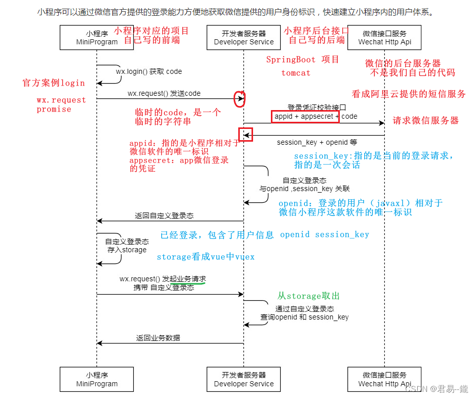

# jiujiu CRM

  **文档版本**

| 版本号 | 修改日期       | 编写   | 修改内容                     | 备注 |
| ------ |------------| ------ | ---------------------------- | ---- |
| V1.0.0 | 2023/07/01 | bolei | 新建                         |      |

## 一、相关术语

| 序号 | 术语/缩略语 | 全称和说明                                                   |
| ---- |--------| ----------------------------------------------------------- |
| 1    | CRM    | 客户关系管理（Customer Relationship Management）                  |

## 二、业务介绍

## 三、技术框架
- 端口说明

|                | port  | 备注 |
|----------------|-------| --- |
| server         | 8072  |      | 
| sofa rest      | 8342  |      | 
| sofa bolt      | 12202 |      | 
| shenyu gateway | 9195  |      | 

- [swagger接口](https://www.sofastack.tech/projects/sofa-rpc/restful-swagger/)
>* 应用启动后，访问 http://localhost:8342/swagger/openapi 即可得到当前的应用发布的所有的 RESTful 的服务的信息

## 曲线积分铸造流程说明
1、任务审核通过根据任务权益的激励数量铸造曲线积分
2、通过切面监听曲线积分铸造
3、监听积分铸造判断是否达到触发token释放分配条件
4、达到条件则根据token释放条件配置执行分配
5、token分配给持有pass card的成员对应的账户

## 微信小程序和公众号对接
https://github.com/Wechat-Group/WxJava

### [微信小程序授权登录相关](https://blog.csdn.net/weixin_74352229/article/details/133963036)

- 实现微信授权登录的主要原理流程如下：
* 在小程序中创建一个“登录”按钮或其他触发授权登录的交互元素。
* 用户点击登录按钮后，小程序调用wx.login接口获取临时登录凭证code。
* 小程序调用wx.getUserInfo接口获取用户的基本信息，例如昵称、头像等。
* 小程序将获取到的临时登录凭证code和用户基本信息发送给开发者自己的后台服务器。
* 开发者的后台服务器收到请求后，通过code调用微信的登录凭证校验接口，验证凭证的有效性，并获取到openid和session_key。
* 开发者的后台服务器根据获取的openid和session_key生成一个自定义的用户标识 token，并返回给小程序。
* 小程序将自定义的用户标识 token 存储起来，作为用户登录的凭证。
* 用户在之后的小程序访问中，可以携带这个自定义的用户标识 token 请求开发者的后台服务器，进行用户身份的验证和数据操作。
* 开发者可以在后台服务器中根据用户的openid进行用户识别和管理，例如创建新用户、更新用户信息、绑定其他第三方账号等。
* 如果开发者需要获得用户的更多个人信息，例如手机号码、地理位置等，可以引导用户进行相应的授权，通过调用相应的接口获取这些信息。
* 如果小程序需要将用户的登录状态同步到其他终端（如PC端、移动App等），开发者可以通过在后台服务器中记录登录状态，实现多终端的登录一致性。
* 对于用户敏感操作或需要保护的数据，开发者可以在后台服务器进行权限验证，确保用户有足够的权限进行相应的操作。 

### 分用账户设计

1、进行分佣的时候，进入到用户的待结算账户
2、靠任务根据结算周期定时结算到客户的余额账户
3、用户提现操作：用户进行打款