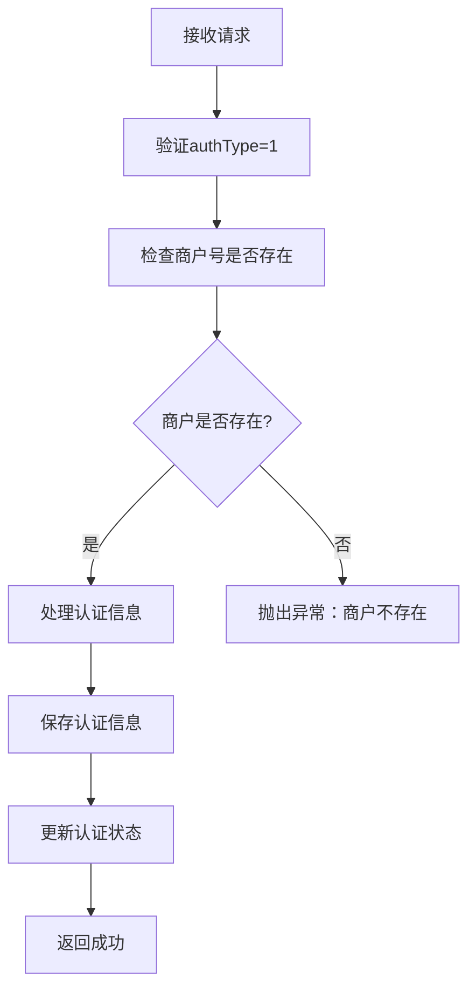
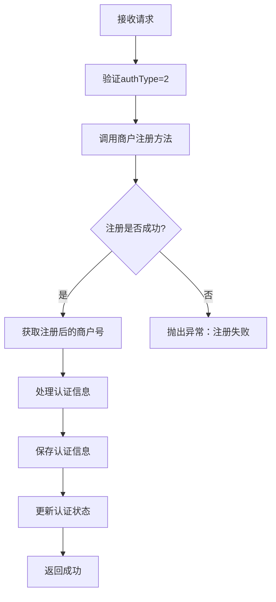

# 商户认证使用指南

## 概述

商户认证功能支持两种模式：
1. **注册之后正常认证进件**（authType=1）：商户已注册，进行认证信息补充
2. **注册同时进件**（authType=2）：注册商户的同时进行认证信息录入

## 功能特性

- ✅ 支持两种认证模式
- ✅ 自动调用商户注册方法
- ✅ 分步认证信息录入（基础信息、法人信息、营业信息、结算信息）
- ✅ 完善的错误处理和日志记录
- ✅ 事务性保证

## 认证模式说明

### 模式1：注册之后正常认证进件（authType=1）

**适用场景**：商户已经通过注册接口创建，需要补充认证信息

**处理流程**：
1. 验证商户是否存在
2. 处理认证信息录入
3. 更新认证状态

**请求示例**：
```json
{
  "authType": "1",
  "tenantId": "TENANT_001",
  "baseInfo": {
    "merchantName": "已注册商户有限公司",
    "logoUrl": "https://example.com/logo.png",
    "contactPhone": "400-123-4567"
  }
}
```

### 模式2：注册同时进件（authType=2）

**适用场景**：新商户注册时同时录入认证信息

**处理流程**：
1. 调用商户注册方法
2. 获取注册后的商户号
3. 处理认证信息录入
4. 更新认证状态

**请求示例**：
```json
{
  "authType": "2",
  "tenantId": "TENANT_001",
  "username": "testmerchant",
  "password": "123456",
  "merchantName": "测试商户有限公司",
  "verifyCode": "VERIFY_001",
  "registerMethod": "operatorRegister",
  "baseInfo": {
    "merchantName": "测试商户有限公司",
    "contactPhone": "400-123-4567"
  }
}
```

## API接口

### 商户认证接口

**接口路径**：`/merchantAuth/authentication`

**请求方法**：POST

**请求参数**：

| 参数名 | 类型 | 必填 | 说明 |
|--------|------|------|------|
| authType | String | 是 | 认证类型：1-注册后认证，2-注册同时认证 |
| tenantId | String | 否 | 租户ID，不传则使用当前登录用户的租户ID |
| username | String | 条件必填 | 用户名（authType=2时必填） |
| password | String | 条件必填 | 密码（authType=2时必填） |
| merchantName | String | 条件必填 | 商户名称（authType=2时必填） |
| verifyCode | String | 条件必填 | 验证码（authType=2时必填） |
| registerMethod | String | 条件必填 | 注册方式（authType=2时必填） |
| baseInfo | Object | 否 | 基础信息 |
| legalEntityInfo | Object | 否 | 法人信息 |
| businessInfo | Object | 否 | 营业信息 |
| settlementInfo | Object | 否 | 结算信息 |

### 认证信息结构

#### 基础信息（baseInfo）
```json
{
  "merchantName": "商户名称",
  "logoUrl": "Logo图片URL",
  "contactPhone": "联系电话",
  "website": "网站地址",
  "merchantAddress": "商户地址",
  "description": "商户描述",
  "category": "商户类别",
  "merchantType": "商户类型"
}
```

#### 法人信息（legalEntityInfo）
```json
{
  "legalPersonName": "法人姓名",
  "legalPersonCredType": "证件类型",
  "legalPersonCredNo": "证件号码"
}
```

#### 营业信息（businessInfo）
```json
{
  "businessLicenceImg": "营业执照图片URL",
  "businessNo": "营业执照号",
  "businessScope": "经营范围",
  "businessType": "业务类型"
}
```

#### 结算信息（settlementInfo）
```json
{
  "accountName": "账户名称",
  "accountNumber": "账户号码",
  "bankName": "银行名称",
  "bankBranch": "支行名称"
}
```

## 业务流程

### 模式1流程（authType=1）



### 模式2流程（authType=2）



## 错误处理

### 常见错误及解决方案

1. **商户号不能为空**
   ```json
   {
     "code": "MERCHANT_NO_EMPTY",
     "message": "商户号不能为空"
   }
   ```
   **解决方案**：确保在authType=1时提供了有效的商户号

2. **商户不存在**
   ```json
   {
     "code": "MERCHANT_NOT_EXISTS",
     "message": "商户不存在，请先注册"
   }
   ```
   **解决方案**：先调用注册接口创建商户，或使用authType=2模式

3. **商户注册失败**
   ```json
   {
     "code": "MERCHANT_REGISTER_ERROR",
     "message": "商户注册失败：具体错误信息"
   }
   ```
   **解决方案**：检查注册参数是否正确，验证码是否有效

4. **认证信息验证失败**
   ```json
   {
     "code": "AUTH_INFO_VALIDATION_ERROR",
     "message": "认证信息验证失败"
   }
   ```
   **解决方案**：检查认证信息的完整性和格式

## 测试用例

### 1. 注册同时进件测试

```http
POST http://localhost:8080/merchantAuth/authentication
Content-Type: application/json

{
  "authType": "2",
  "tenantId": "TENANT_001",
  "username": "testmerchant",
  "password": "123456",
  "merchantName": "测试商户有限公司",
  "verifyCode": "VERIFY_001",
  "registerMethod": "operatorRegister",
  "baseInfo": {
    "merchantName": "测试商户有限公司",
    "contactPhone": "400-123-4567"
  }
}
```

### 2. 注册后认证测试

```http
POST http://localhost:8080/merchantAuth/authentication
Content-Type: application/json

{
  "authType": "1",
  "tenantId": "TENANT_001",
  "baseInfo": {
    "merchantName": "已注册商户有限公司",
    "contactPhone": "400-123-4567"
  }
}
```

## 注意事项

1. **事务性保证**
   - 整个认证过程在事务中执行
   - 任何步骤失败都会回滚所有操作

2. **商户号处理**
   - authType=1：使用当前登录用户的商户号
   - authType=2：从注册结果中获取新的商户号

3. **认证状态**
   - 有认证信息更新时，自动设置为待审核状态
   - 支持分步认证，可以只更新部分信息

4. **日志记录**
   - 所有操作都有详细的日志记录
   - 便于问题排查和审计

5. **参数验证**
   - 自动验证必填参数
   - 支持灵活的认证信息结构

## 更新日志

- **v1.0.0**: 初始版本，支持基本的认证功能
- **v1.1.0**: 添加两种认证模式支持
- **v1.2.0**: 完善错误处理和日志记录
- **v1.3.0**: 优化商户号处理逻辑 