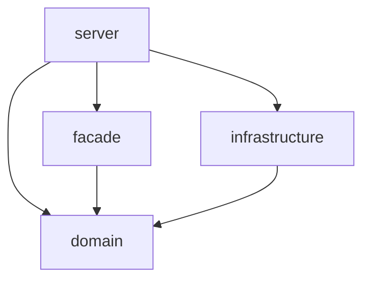

# BSIN server Scaffold 应用开发指南

## 📋 目录
- [项目概述](#项目概述)
- [架构设计](#架构设计)
- [快速开始](#快速开始)
- [开发流程](#开发流程)
- [最佳实践](#最佳实践)
- [常见问题](#常见问题)
- [参考资源](#参考资源)

## 🎯 项目概述

BSIN server Scaffold 是一个基于 Apache Dubbo 的微服务开发脚手架，采用分层架构设计，提供标准化的开发模板和最佳实践。

### ✨ 核心特性
- 🏗️ **分层架构**：清晰的模块划分，职责分离
- 🔧 **开箱即用**：预配置的 Dubbo + Shenyu 集成
- 📦 **模块化设计**：支持独立开发和部署
- 🚀 **快速开发**：标准化的开发流程和代码模板

## 🏗️ 架构设计

### 模块结构
```
bsin-server-scaffold-dubbo/
├── scaffold-domain-dubbo/         # 领域模型层
├── scaffold-facade-dubbo/         # 服务接口层
├── scaffold-infrastructure-dubbo/ # 基础设施层
├── scaffold-server-dubbo/         # 服务实现层
└── pom.xml                        # 父模块配置
```

### 各层职责

| 模块 | 职责 | 主要内容 |
|------|------|----------|
| **domain** | 领域模型 | 实体类、DTO、枚举、常量 |
| **facade** | 服务接口 | Dubbo 服务接口定义 |
| **infrastructure** | 基础设施 | 数据库、缓存、消息队列集成 |
| **server** | 服务实现 | 业务逻辑实现、服务暴露 |

### 依赖关系


## 🚀 快速开始

### 环境要求
- JDK 8+
- Maven 3.6+
- IDE (推荐 IntelliJ IDEA)

### 1. 克隆项目
```bash
git clone <repository-url>
cd bsin-server-scaffold/bsin-server-scaffold-dubbo
```

### 2. 编译项目
```bash
mvn clean install
```

### 3. 启动服务
```bash
cd scaffold-server-dubbo
mvn spring-boot:run
```

## 📝 开发流程

### 步骤 1: 定义领域对象

在 `scaffold-domain-dubbo` 中创建实体类：

```java
package me.flyray.bsin.domain.entity;

import lombok.Data;
import java.io.Serializable;

@Data
public class DubboTest implements Serializable {
    private String id;
    private String eventCode;
    private String description;
    private Date createTime;
    
    public DubboTest(String id, String eventCode) {
        this.id = id;
        this.eventCode = eventCode;
        this.createTime = new Date();
    }
}
```

### 步骤 2: 定义服务接口

在 `scaffold-facade-dubbo` 中创建服务接口：

```java
package me.flyray.bsin.facade.service;

import me.flyray.bsin.domain.entity.DubboTest;
import me.flyray.bsin.domain.entity.ListResp;

public interface DubboClassTestService {
    /**
     * 根据ID查询
     */
    DubboTest findById(String id);
    
    /**
     * 查询所有
     */
    DubboTest findAll();
    
    /**
     * 新增数据
     */
    DubboTest insert(DubboTest dubboTest);
    
    /**
     * 查询列表
     */
    ListResp findList();
}
```

### 步骤 3: 实现服务逻辑

在 `scaffold-server-dubbo` 中实现服务：

```java
package me.flyray.bsin.server.impl;

import lombok.extern.slf4j.Slf4j;
import org.apache.dubbo.rpc.RpcContext;
import org.apache.shenyu.client.apache.dubbo.annotation.ShenyuDubboService;
import org.springframework.stereotype.Service;

@Slf4j
@Service
@ShenyuDubboService("/demo/**")
public class DubboClassTestServiceImpl implements DubboClassTestService {
    
    @Override
    public DubboTest findById(String id) {
        log.info("查询ID: {}, 上下文信息: {}", id, 
                RpcContext.getContext().getObjectAttachments());
        return new DubboTest(id, "查询结果");
    }
    
    @Override
    public DubboTest findAll() {
        String randomId = String.valueOf(new Random().nextInt());
        log.info("查询所有数据，生成ID: {}", randomId);
        return new DubboTest(randomId, "所有数据");
    }
    
    @Override
    public DubboTest insert(DubboTest dubboTest) {
        log.info("新增数据: {}", dubboTest);
        dubboTest.setEventCode("新增: " + dubboTest.getEventCode());
        return dubboTest;
    }
    
    @Override
    public ListResp findList() {
        List<DubboTest> list = Arrays.asList(
            new DubboTest("1", "测试数据1"),
            new DubboTest("2", "测试数据2")
        );
        return new ListResp(list.size(), list);
    }
}
```

### 步骤 4: 配置服务

在 `scaffold-server-dubbo/src/main/resources/` 中配置：

```yaml
# application.yml
spring:
  application:
    name: bsin-dubbo-scaffold

dubbo:
  application:
    name: ${spring.application.name}
  protocol:
    name: dubbo
    port: 20880
  registry:
    address: zookeeper://localhost:2181
  scan:
    base-packages: me.flyray.bsin.server.impl

shenyu:
  client:
    dubbo:
      app-name: ${spring.application.name}
```

## 💡 最佳实践

### 1. 命名规范

| 类型 | 命名规范 | 示例 |
|------|----------|------|
| 实体类 | 驼峰命名，无后缀 | `DubboTest` |
| 服务接口 | 驼峰命名，Service后缀 | `DubboClassTestService` |
| 服务实现 | 驼峰命名，ServiceImpl后缀 | `DubboClassTestServiceImpl` |
| 包名 | 全小写，点分隔 | `me.flyray.bsin.server.impl` |

### 2. 异常处理

```java
@Override
public DubboTest findById(String id) {
    try {
        if (StringUtils.isEmpty(id)) {
            throw new IllegalArgumentException("ID不能为空");
        }
        return new DubboTest(id, "查询结果");
    } catch (Exception e) {
        log.error("查询失败，ID: {}, 错误: {}", id, e.getMessage(), e);
        throw new RuntimeException("查询失败: " + e.getMessage());
    }
}
```

### 3. 日志规范

```java
@Slf4j
public class DubboClassTestServiceImpl {
    
    public DubboTest findById(String id) {
        log.debug("开始查询，ID: {}", id);
        
        try {
            DubboTest result = // 业务逻辑
            log.info("查询成功，ID: {}, 结果: {}", id, result);
            return result;
        } catch (Exception e) {
            log.error("查询失败，ID: {}, 错误: {}", id, e.getMessage(), e);
            throw e;
        }
    }
}
```

### 4. 参数校验

```java
@Override
public DubboTest insert(DubboTest dubboTest) {
    // 参数校验
    Assert.notNull(dubboTest, "参数不能为空");
    Assert.hasText(dubboTest.getEventCode(), "事件代码不能为空");
    
    // 业务逻辑
    return dubboTest;
}
```

## ❓ 常见问题

### Q1: 如何新增一个 Dubbo 服务？
**A:** 按照以下步骤：
1. 在 `domain` 中定义实体类
2. 在 `facade` 中定义服务接口
3. 在 `server` 中实现服务并添加 `@ShenyuDubboService` 注解
4. 配置并启动服务

### Q2: 如何调试 Dubbo 服务？
**A:** 推荐以下方法：
- 使用 Dubbo Admin 控制台
- 本地启动服务，通过单元测试调试
- 使用日志查看调用链路

### Q3: 如何处理服务异常？
**A:** 
- 使用统一的异常处理机制
- 记录详细的错误日志
- 返回友好的错误信息给客户端

### Q4: 如何优化服务性能？
**A:**
- 使用缓存减少数据库查询
- 合理设置连接池参数
- 使用异步处理提高响应速度

## 📚 参考资源

### 官方文档
- [Apache Dubbo 官方文档](https://dubbo.apache.org/zh/docs/)
- [Apache Shenyu 官方文档](https://shenyu.apache.org/zh/docs/index/)

### 相关技术
- [Spring Boot 官方文档](https://spring.io/projects/spring-boot)
- [Maven 官方文档](https://maven.apache.org/guides/)

### 开发工具
- [IntelliJ IDEA](https://www.jetbrains.com/idea/)
- [Dubbo Admin](https://github.com/apache/dubbo-admin)

---

## 🤝 贡献指南

欢迎提交 Issue 和 Pull Request 来改进这个项目！

### 提交规范
- 使用清晰的提交信息
- 遵循代码规范
- 添加必要的测试用例

---

**最后更新**: 2024年12月
**版本**: 1.0.0