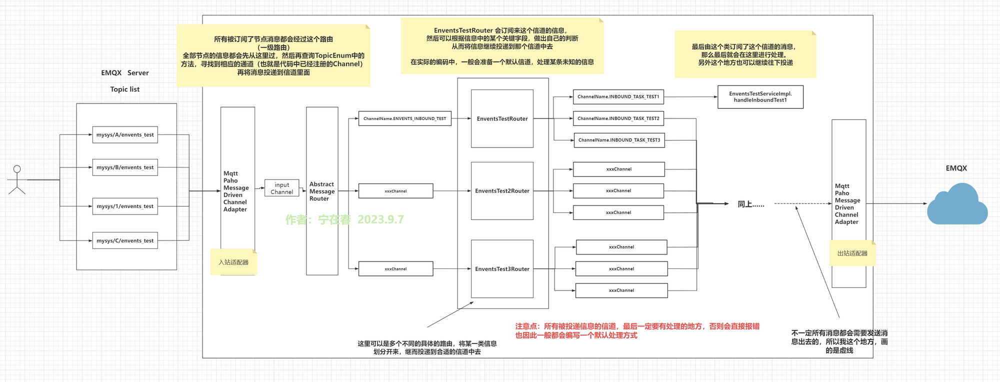

# 介绍
bsin-server-scaffold-mqtt

## [mqtt基础知识](./doc/MQTT.md)

## [shenyu mqtt](https://shenyu.apache.org/zh/docs/plugin-center/proxy/mqtt-plugin)

## [integration-mqtt](https://github.com/ningzaichun/springboot-integration-mqtt-demo)

## 參考 