# MQTT
本文档介绍了MQTT的基本概念，MQTT服务器EMQX的搭建使用，以及如何使用MQTT协议在bsin-paas中实现MQTT服务。

## MQTT 简介
- MQTT（Message Queuing Telemetry Transport，消息队列遥测传输协议），是一种基于发布/订阅 （publish/subscribe）模式的"轻量级"通讯协议，该协议构建于TCP/IP协议上。
- MQTT 是物联网 (IoT) 的 OASIS 标准消息传递协议。它被设计为一种极其轻量级的发布/订阅消息传递传输，非常适合以较小的代码占用空间和最小的网络带宽连接远程设备。  
- MQTT 的核心是MQTT 代理和 MQTT 客户端。MQTT 代理是发送者和接收者之间的中介，负责将消息分发给适当的接收者。MQTT 客户端向代理发布消息，其他客户端则订阅特定主题以接收消息。每条 MQTT 消息都包含一个主题，客户端会订阅自己感兴趣的主题。MQTT 代理会维护一个订阅者列表，并使用该列表将消息传递给相关客户端
- MQTT 代理还可以为断开连接的客户端缓冲消息，确保即使在网络不稳定的情况下也能可靠地传递消息。为了实现这一点，MQTT 支持三种不同的服务质量(QoS) 级别：0（最多一次）、1（至少一次）和 2（恰好一次）。
- MQTT 规范有两个版本：MQTT 3.1.1 和 MQTT 5。虽然大多数商业 MQTT 代理现在都支持 MQTT 5，但一些 IoT 管理云服务仍然主要支持 MQTT 3.1.1。
  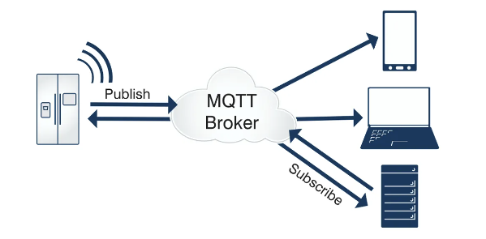

## [EMQX](https://docs.emqx.com/zh/emqx/v5.5/)
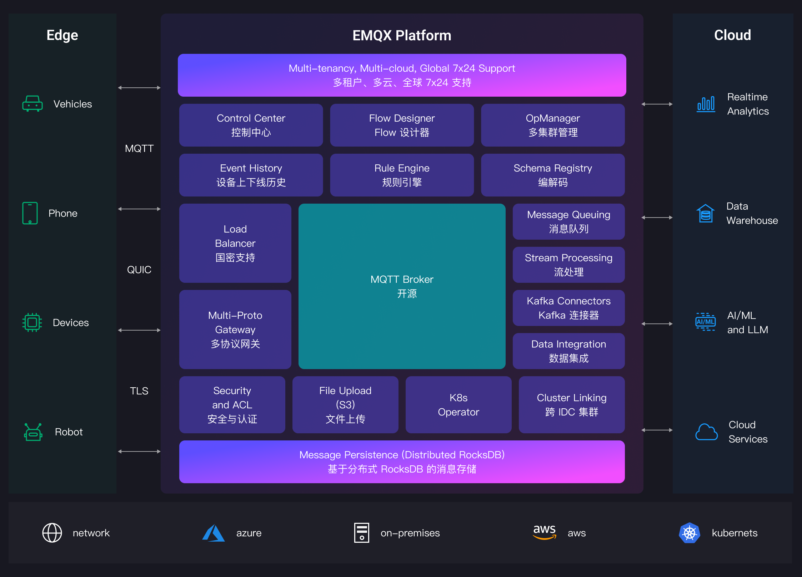
- EMQX 是一款基于 Erlang/OTP 平台开发的M大规模分布式 MQTT 消息服务器，功能丰富，专为物联网和实时通信应用而设计。EMQX 5.0 单集群支持 MQTT 并发连接数高达 1 亿条，单服务器的传输与处理吞吐量可达每秒百万级 MQTT 消息，同时保证毫秒级的低时延。
- EMQX 支持多种协议，包括 MQTT (3.1、3.1.1 和 5.0)、HTTP、QUIC 和 WebSocket 等，保证各种网络环境和硬件设备的可访问性。EMQX 还提供了全面的 SSL/TLS 功能支持，比如双向认证以及多种身份验证机制，为物联网设备和应用程序提供可靠和高效的通信基础设施。
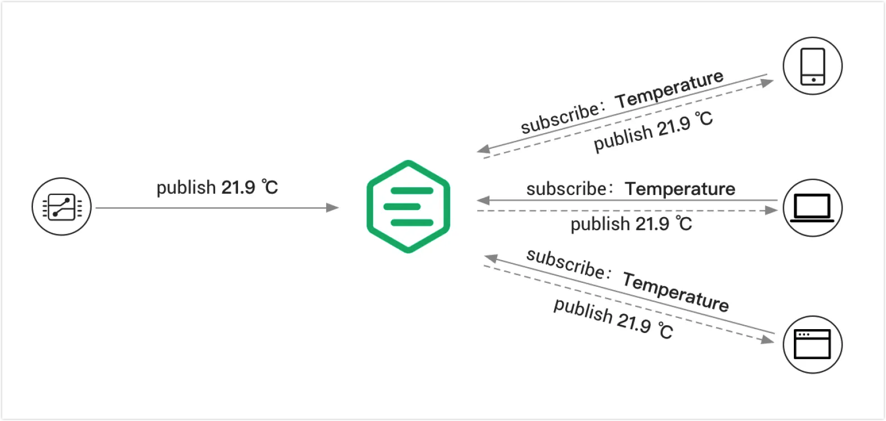

## MQTT协议原理
MQTT协议中有三种身份：发布者 （Publish）、代理（Broker）（服务器）、订阅者（Subscribe）。其中，消息的发布者和订阅者都是客户端，消 息代理是服务器，消息发布者可以同时是订阅者。 MQTT传输的消息分为：主题（Topic）和负载（payload）两部分：
- Topic，可以理解为消息的类型，订阅者订阅（Subscribe）后，就会收到该主题的消息内容 （payload）；
- payload，可以理解为消息的内容，是指订阅者具体要使用的内容。

### 发布/订阅、主题、会话
- 订阅者(Subscriber) 会向 消息服务器(Broker) 订阅一个 主题(Topic) 。成功订阅后，消息服务器会将该主题 下的消息转发给所有的订阅者。
- 主题(Topic)以 ‘/’ 为分隔符区分不同的层级。包含通配符 ‘+’ 或 ‘#’ 的主题又称为 主题过滤器(Topic Filters); 不 含通配符的称为 主题名(Topic Names)
- 发布者(Publisher)只能向 ‘主题名’ 发布消息，订阅者(Subscriber) 则可以通过订阅 ‘主题过滤器’ 来通配多个主 题名称。
每个客户端与服务器建立连接后就是一个会话，客户端和服务器之间有状态交互。会话存在于一个网络之间， 也可能在客户端和服务器之间跨越多个连续的网络连接

### MQTT协议中的方法
-（1）CONNECT：客户端连接到服务器
-（2）CONNACK：连接确认
-（3）PUBLISH：发布消息
-（4）PUBACK：发布确认
-（5）PUBREC：发布的消息已接收
-（6）PUBREL：发布的消息已释放
-（7）PUBCOMP：发布完成
-（8）SUBSCRIBE：订阅请求
-（9）SUBACK：订阅确认
-（10）UNSUBSCRIBE：取消订阅
-（11）UNSUBACK：取消订阅确认
-（12）PINGREQ：客户端发送心跳
-（13）PINGRESP：服务端心跳响应
-（14）DISCONNECT：断开连接
-（15）AUTH：认证

### MQTT协议数据包结构
在MQTT协议中，一个MQTT数据包由：固定头（Fixed header）、可变头（Variable header）、消息体 （payload）三部分构成。MQTT数据包结构如下：
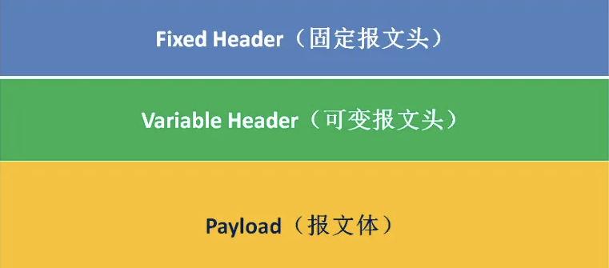
- 固定头（Fixed header）。存在于所有MQTT数据包中，表示数据包类型及数据包的分组类标识， 如连接，发布，订阅，心跳等。其中固定头是必须的，所有类型的MQTT协议中，都必须包含固定头。
- 可变头（Variable header）。存在于部分MQTT数据包中，数据包类型决定了可变头是否存在及其 具体内容。可变头部不是可选的意思，而是指这部分在有些协议类型中存在，在有些协议中不存在。
- 消息体（Payload）。存在于部分MQTT数据包中，表示客户端收到的具体内容。 与可变头一样， 在有些协议类型中有消息内容，有些协议类型中没有消息内容

### MQTT工作流程
- 1、客户端使用 TCP/IP 协议与 Broker 建立连接，可以选择使用 TLS/SSL 加密来实现安全通信。客户端提供认证信息，并指定会话类型（Clean Session 或 Persistent Session）。
- 2、客户端既可以向特定主题发布消息，也可以订阅主题以接收消息。当客户端发布消息时，它会将消息发送给 MQTT Broker；而当客户端订阅消息时，它会接收与订阅主题相关的消息。
- 3、MQTT Broker 接收发布的消息，并将这些消息转发给订阅了对应主题的客户端。它根据 QoS 等级确保消息可靠传递，并根据会话类型为断开连接的客户端存储消息。

## MQTT Broker
您可以选择私有部署或完全托管的云服务来建立自己的 MQTT Broker。或者您也可以使用免费的公共 Broker。在这里选择EMQX私有部署作为 MQTT Broker。
### [EMQX搭建](https://docs.emqx.com/zh/emqx/latest/deploy/install-ubuntu-ce.html)
- 安装
~~~bash
# 开发部署环境为 ubuntu20.04
# 1.docker安装
# 1.1、获取 Docker 镜像
docker pull emqx/emqx:5.8.2
# 1.2、启动 Docker 容器
docker run -d --name emqx -p 1883:1883 -p 8083:8083 -p 8084:8084 -p 8883:8883 -p 18083:18083 emqx/emqx:5.8.2

# 2.通过 Apt 源安装
# 2.1、配置 EMQX Apt 源
curl -s https://assets.emqx.com/scripts/install-emqx-deb.sh | sudo bash
# 2.2、安装 EMQX
sudo apt-get install emqx
# 2.3、启动 EMQX 服务
sudo systemctl start emqx
# 2.4 卸载
sudo apt remove --purge emqx
# 2.5 关闭开机自启
sudo systemctl disable emqx
# 2.6 开启开机自启
sudo systemctl disable emqx
# 2.7 停止服务
sudo systemctl stop emqx
~~~
- 登录：http://localhost:18083  
初始账号：admin  
密码：public  
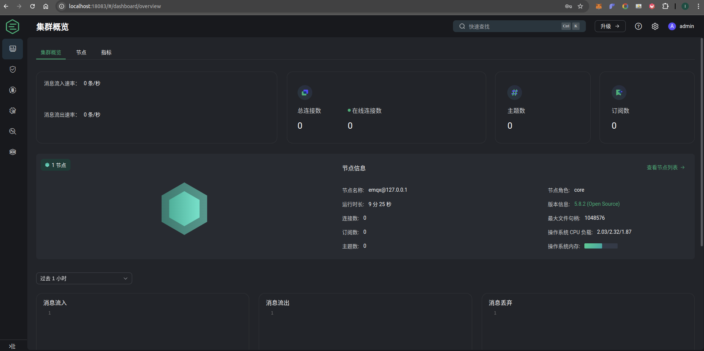

### MQTT客户端 
MQTTX 是一款跨平台的 MQTT 5.0 桌面客户端，可在 macOS、Linux、Windows 操作系统上运行。其用户友好的聊天式界面使用户能够轻松创建多个 MQTT/MQTTS 连接，并进行 MQTT 消息的订阅和发布。同时也提供的支持浏览器访问的 MQTT 客户端工具，访问地址为：https://mqttx.app/web-client/

#### MQTTX 客户端下载安装
~~~bash
# 下载地址： https://www.emqx.com/zh/downloads/MQTTX/v1.11.0/MQTTX_1.11.0_amd64.deb
# 安装
sudo dpkg -i MQTTX_1.11.0_amd64.deb
~~~

#### 配置MQTTX客户端，创建 MQTT 连接
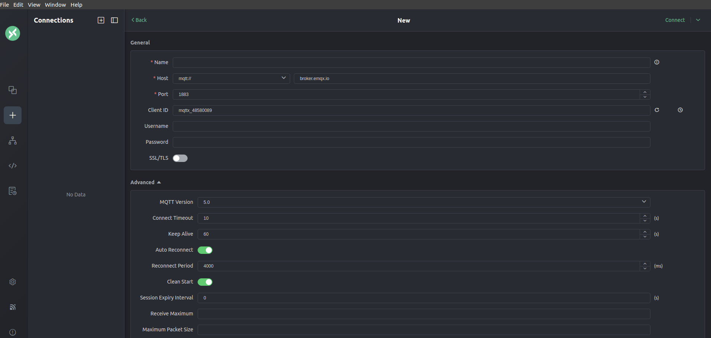
要了解更多关于 MQTT 连接参数的内容，请查看我们的文章：建立 MQTT [连接时如何设置参数](https://www.emqx.com/zh/blog/how-to-set-parameters-when-establishing-an-mqtt-connection)。

#### 通过通配符订阅主题
点击 New Subscription 按钮，在弹出框中的 Topic 字段中输入主题 sensor/+/temperature，QoS 保持默认值 0
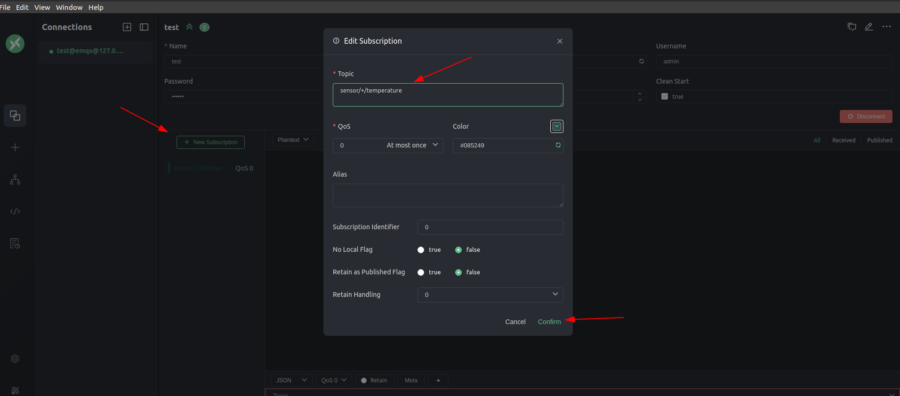

#### 发布 MQTT 消息
- 点击左侧菜单上的 + 按钮创建两个连接，分别命名为 Sensor 1 和 Sensor 2，用来模拟两个温度传感器
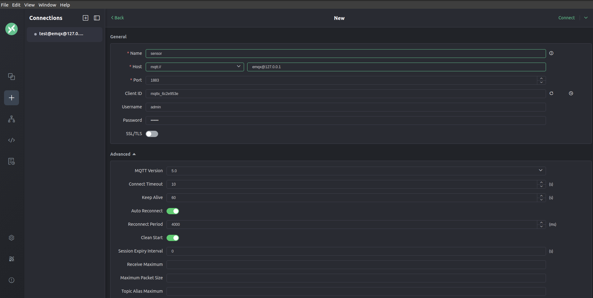
- 总共4个连接，3个连接是绿色的表示连接ok
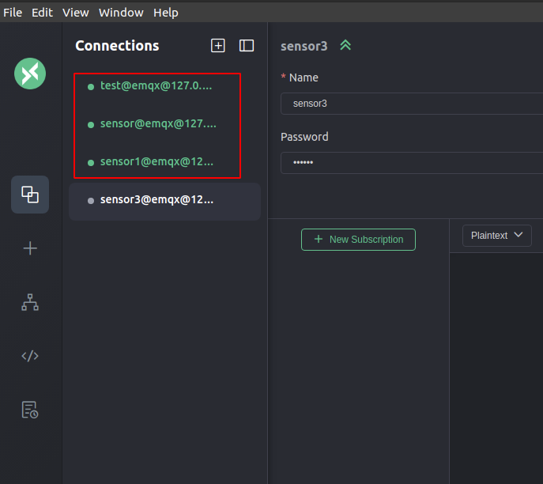
- emqx 控制面板查看连接情况
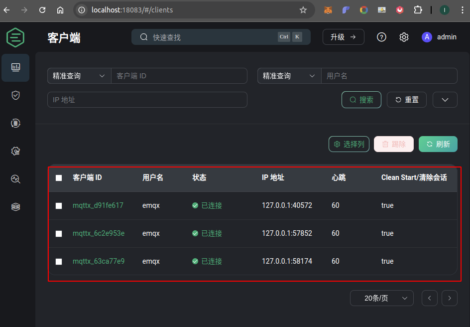
- 选择 Sensor1 连接，在页面下方的发布主题中输入 sensor/1/temperature，在消息框中输入以下 JSON 格式的消息，然后点击右下方的发布按钮发送消息
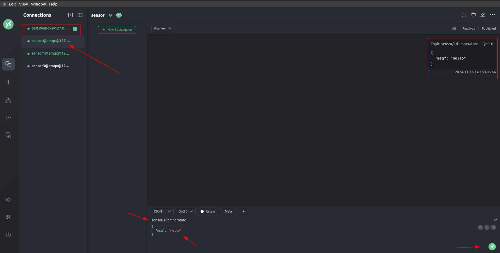