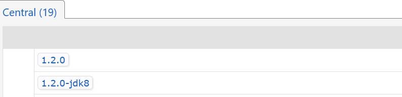
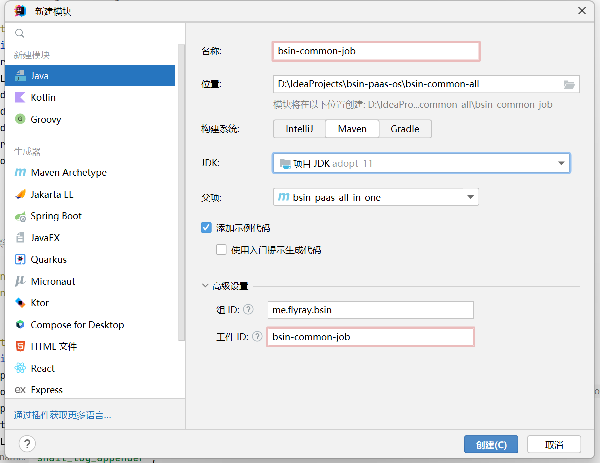
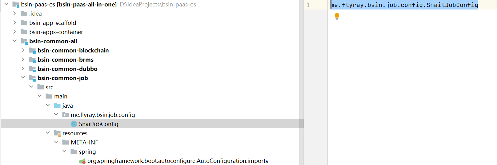
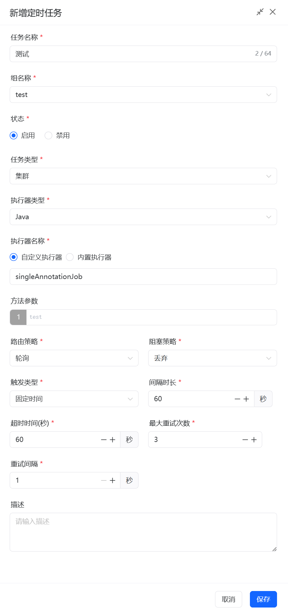
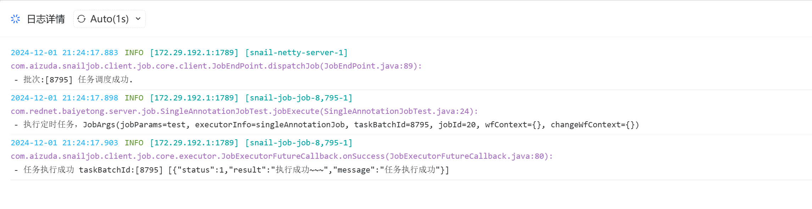
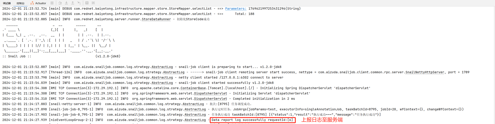

# Snail-Job 集成

> [官网](https://snailjob.opensnail.com/)

### 1. 服务端部署

+ `docker环境`  

 #### 1.1 执行数据库脚本

根据当前使用的数据库运行官网提供的[sql脚本](https://gitee.com/aizuda/snail-job/tree/master/doc/sql)

#### 1.2  docker-compose

```yaml
services:
  snail-job-server:
    image: opensnail/snail-job:latest
    container_name: snail-job-server
    ports:
      - "8080:8080"
      - "17888:17888"
    environment:
      SPRING_DATASOURCE_USERNAME: root
      SPRING_DATASOURCE_PASSWORD: your password
      SPRING_DATASOURCE_URL: jdbc:mysql://IP:3306/snail_job?useUnicode=true&characterEncoding=UTF-8&autoReconnect=true&serverTimezone=Asia/Shanghai
      SPRING_DATASOURCE_DRIVER_CLASS_NAME: com.mysql.cj.jdbc.Driver
      SNAIL_JOB_RPC_TYPE: grpc
    volumes:
      - ./snail-job/logs:/snailjob/server/data/log:rw   

```

将上面的内容粘贴到服务器上的`docker-compose.yml` 文件中，然后运行命令

```bash
docker-compose up -d snail-job-server
```

> ps: 需要修改`SPRING_DATASOURCE_PASSWORD` 、`SPRING_DATASOURCE_URL` 

### 2.  客户端集成

#### 2.1 pom.xml

```xml
<dependency>
    <groupId>com.aizuda</groupId>
    <artifactId>snail-job-client-starter</artifactId>
    <version>${snail-job.version}</version>
</dependency>
<dependency>
    <groupId>com.aizuda</groupId>
    <artifactId>snail-job-client-job-core</artifactId>
    <version>${snail-job.version}</version>
</dependency>
<dependency>
    <groupId>com.aizuda</groupId>
    <artifactId>snail-job-client-retry-core</artifactId>
    <version>${snail-job.version}</version>
</dependency>
```

> 需要注意JDK17及以上和JDK8环境中 版本号有区别



#### 2.2 客户端配置

```yaml
snail-job:
  # 任务调度服务器信息
  server:
    # 服务器IP地址（或域名）
    host: 127.0.0.1
    # 服务器通讯端口（不是后台管理页面服务端口）
    port: 17888
  # 命名空间【唯一标识】
  namespace:
  # 接入组名（需要在 SnailJob 后台组管理创建对应名称的组）注意：若通过注解配置了这里的配置不生效
  group:
  # 接入组 token
  token:
  # 客户端绑定IP，必须服务器可以访问到；默认自动推断，在服务器无法调度客户端时需要手动配置
#  host: 
  # 客户端通讯端口，默认 17889；若指定-1则会生成随机端口
  port: 17889
  #通知类型默认使用netty,后续版本会逐渐废弃netty采用grpc
  rpc-type: grpc
```

然后需要在启动类中添加注解：`@EnableSnailJob`

```java
@SpringBootApplication
@EnableSnailJob 
public class SnailJobSpringbootApplication {
    public static void main(String[] args) {
        SpringApplication.run(SnailJobSpringbootApplication.class, args);
    }
}
```

#### 2.3 日志配置

+ ## logback.xml

```xml
<!-- Snail appender -->
<appender name="snailLogAppender" class="com.aizuda.snailjob.client.common.appender.SnailLogbackAppender"></appender>

<!-- 控制台输出日志级别 -->
<root level="info">  
    .... 其他配置 ....
    <appender-ref ref="snailLogAppender" />
</root>
```

+ ## log4j2.xml

```xml
 <!-- SnailLog4j2 appender -->
 <SnailLog4j2Appender name="SnailLog4j2Appender" ignoreExceptions="true" />

<Loggers>
    <Root level="info">
        .... 其他配置 ....
        <AppenderRef ref="SnailLog4j2Appender"/>
    </Root>
</Loggers>
```

#### 2.4 模块化（推荐）

1. **新建模块**



2. **在`pom.xml`文件中引入`Snail-Job`的依赖**

```xml
<?xml version="1.0" encoding="UTF-8"?>
<project xmlns="http://maven.apache.org/POM/4.0.0"
         xmlns:xsi="http://www.w3.org/2001/XMLSchema-instance"
         xsi:schemaLocation="http://maven.apache.org/POM/4.0.0 http://maven.apache.org/xsd/maven-4.0.0.xsd">
    <modelVersion>4.0.0</modelVersion>
    <parent>
        <groupId>me.flyray.bsin</groupId>
        <artifactId>bsin-common-all</artifactId>
        <version>3.0.0-SNAPSHOT</version>
    </parent>

    <artifactId>bsin-common-job</artifactId>
    <packaging>jar</packaging>
    <description>bsin-common-job 定时任务模块</description>

    <properties>
        <snail-job.version>1.3.0-beta1-jdk8</snail-job.version>
    </properties>
    
    <dependencies>
        <dependency>
            <groupId>org.springframework.boot</groupId>
            <artifactId>spring-boot-autoconfigure</artifactId>
        </dependency>

        <dependency>
            <groupId>org.projectlombok</groupId>
            <artifactId>lombok</artifactId>
        </dependency>

        <!-- SnailJob client -->
        <dependency>
            <groupId>com.aizuda</groupId>
            <artifactId>snail-job-client-starter</artifactId>
            <version>${snail-job.version}</version>
        </dependency>
        <dependency>
            <groupId>com.aizuda</groupId>
            <artifactId>snail-job-client-job-core</artifactId>
            <version>${snail-job.version}</version>
        </dependency>
        <dependency>
            <groupId>com.aizuda</groupId>
            <artifactId>snail-job-client-retry-core</artifactId>
            <version>${snail-job.version}</version>
        </dependency>

        <!-- Logback 依赖 -->
        <dependency>
            <groupId>ch.qos.logback</groupId>
            <artifactId>logback-classic</artifactId>
            <scope>provided</scope>
        </dependency>

        <!-- Log4j2 依赖 -->
        <dependency>
            <groupId>org.apache.logging.log4j</groupId>
            <artifactId>log4j-core</artifactId>
            <scope>provided</scope>
        </dependency>
    </dependencies>

</project>
```

3. **配置类**

```java
/**
 * SnailJob基础配置
 */
@AutoConfiguration
@ConditionalOnProperty(prefix = "snail-job", name = "enabled", havingValue = "true")
@EnableScheduling
@EnableSnailJob
public class SnailJobConfig {

    /**
     * Logback配置类
     */
    @Configuration
    @ConditionalOnClass(value = {ch.qos.logback.classic.LoggerContext.class,SnailLogbackAppender.class})
    public static class LogbackConfiguration {
        
        @EventListener(SnailClientStartingEvent.class)
        public void onStarting(SnailClientStartingEvent event) {
            LoggerContext context = (LoggerContext) LoggerFactory.getILoggerFactory();
            SnailLogbackAppender<ILoggingEvent> appender = new SnailLogbackAppender<>();
            appender.setName("snail_log_appender");
            appender.setContext(context);
            appender.start();
            Logger rootLogger = context.getLogger(Logger.ROOT_LOGGER_NAME);
            rootLogger.addAppender(appender);
        }
    }

    /**
     * Log4j2配置类
     */
    @Configuration
    @ConditionalOnClass(value = {org.apache.logging.log4j.core.LoggerContext.class,SnailLog4j2Appender.class})
    public static class Log4j2Configuration {
        
        @EventListener(SnailClientStartingEvent.class)
        public void onStarting(SnailClientStartingEvent event) {
            org.apache.logging.log4j.core.LoggerContext context = 
                (org.apache.logging.log4j.core.LoggerContext) org.apache.logging.log4j.LogManager.getContext(false);
            org.apache.logging.log4j.core.config.Configuration config = context.getConfiguration();
            Layout<?> layout = org.apache.logging.log4j.core.layout.PatternLayout.createDefaultLayout(config);
            SnailLog4j2Appender snailAppender = SnailLog4j2Appender.create("snail_log_appender",null,layout,"true",null,null);
            snailAppender.start();
            config.addAppender(snailAppender);
            config.getRootLogger().addAppender(snailAppender, org.apache.logging.log4j.Level.INFO, null);
            context.updateLoggers();
        }
    }
}
```

> ps：**由于配置类中对日志配置进行了配置,就无需在日志框架的xml文件中进行配置**

4.  **Spring Boot 配置**

   + 在`reasource`中依次建立文件夹：`META-INF` 、`spring`

   + 新建文件： `org.springframework.boot.autoconfigure.AutoConfiguration.imports` ，将配置类的包名+类名粘贴到文件中

   ```java
   me.flyray.bsin.job.config.SnailJobConfig
   ```

   


5.  **业务服务端引入**

```xml
    <!-- job -->
    <dependency>
        <groupId>me.flyray.bsin</groupId>
        <artifactId>bsin-common-job</artifactId>
        <version>${version}</version>
    </dependency>
```

**【完整的配置】**

```yaml
snail-job:
  # 是否开启任务调度
  enabled: true
  # 任务调度服务器信息
  server:
    # 服务器IP地址（或域名）
    host: 127.0.0.1
    # 服务器通讯端口（不是后台管理页面服务端口）
    port: 17888
  # 命名空间【唯一标识】
  namespace:
  # 接入组名（需要在 SnailJob 后台组管理创建对应名称的组）注意：若通过注解配置了这里的配置不生效
  group:
  # 接入组 token
  token:
  # 客户端绑定IP，必须服务器可以访问到；默认自动推断，在服务器无法调度客户端时需要手动配置
  # host: 
  # 客户端通讯端口，默认 17889；若指定-1则会生成随机端口
  port: 17889
  #通知类型默认使用netty,后续版本会逐渐废弃netty采用grpc
  rpc-type: grpc
```

### 3. 定时任务

#### 3.1 新建定时任务测试类

```java
@Component
@JobExecutor(name = "singleAnnotationJob")
public class SingleAnnotationJobTest {
    
    /**
     * <p>
     *     由于JobExecutor注解默认的方法名为jobExecute
     *     如果想自定义方法名则：  @JobExecutor(name = "singleAnnotationJob",method=自定义方法名)
     * </p>
     * @param jobArgs
     * @return
     */
    public ExecuteResult jobExecute(JobArgs jobArgs){
        //上报日志
        SnailJobLog.REMOTE.info("执行定时任务，{}",jobArgs);
        return ExecuteResult.success("执行成功~~~");
    }
}
```

#### 3.2 新建定时任务

在Snail-Job的后台界面中的定时任务中点击**新建定时任务**




#### 3.3 执行结果





#### 3.4 示例

+ 注解- 单个任务

```java
    /**
     * <p>
     *     由于JobExecutor注解默认的方法名为jobExecute
     *     如果想自定义方法名则：  @JobExecutor(name = "singleAnnotationJob",method=自定义方法名)
     * </p>
     * @param jobArgs
     * @return
     */
    public ExecuteResult jobExecute(JobArgs jobArgs){
        //上报日志 
        SnailJobLog.REMOTE.info("执行定时任务，{}",jobArgs);
        return ExecuteResult.success("执行成功~~~");
    }
}
```

+ 注解-多个任务

````java
@Component
public class MultipleJobTest {
    
    @JobExecutor(name = "testA")
    public ExecuteResult testA(JobArgs jobArgs){
        //控制台日志
        SnailJobLog.LOCAL.info("执行定时任务A，参数：{}",jobArgs);
        //上报日志到服务端
        SnailJobLog.REMOTE.info("执行定时任务A，参数：{}",jobArgs);
        return ExecuteResult.success("执行成功");
    }


    @JobExecutor(name = "testB")
    public ExecuteResult testB(JobArgs jobArgs){
        //控制台日志
        SnailJobLog.LOCAL.info("执行定时任务B，参数：{}",jobArgs);
        //上报日志到服务端
        SnailJobLog.REMOTE.info("执行定时任务B，参数：{}",jobArgs);
        return ExecuteResult.success("执行成功");
    }

}
````

+ 继承

```java
@Component
public class ExtendJobTest extends AbstractJobExecutor {


    @Override
    protected ExecuteResult doJobExecute(JobArgs jobArgs) {
        SnailJobLog.REMOTE.info("执行定时任务，参数：{}", jobArgs);
        return ExecuteResult.success("执行定时任务成功~");
    }
}

```

