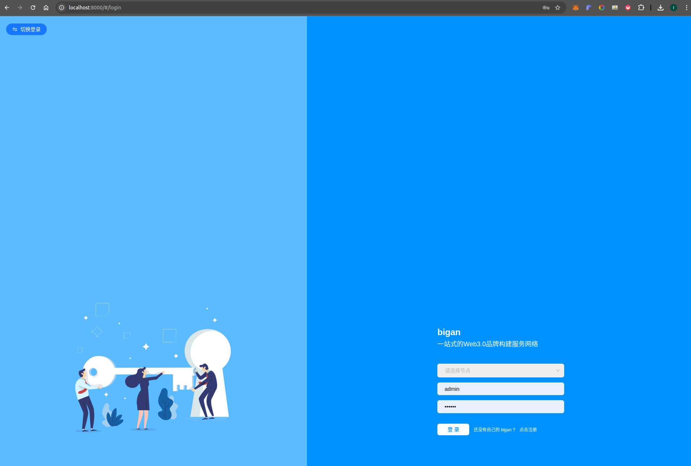
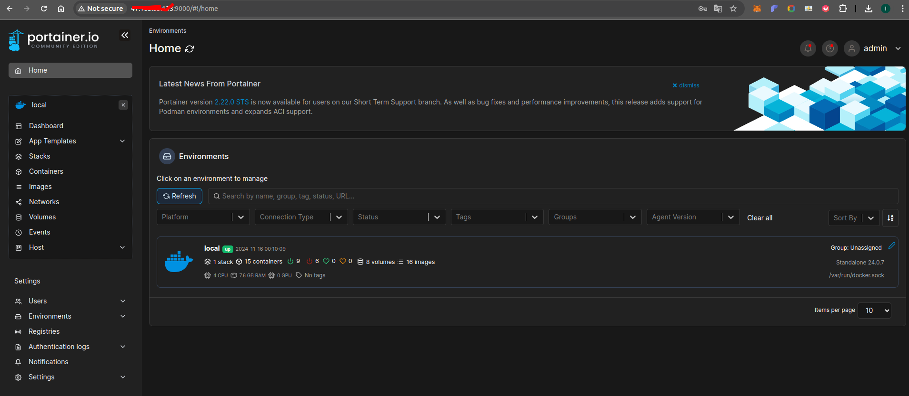
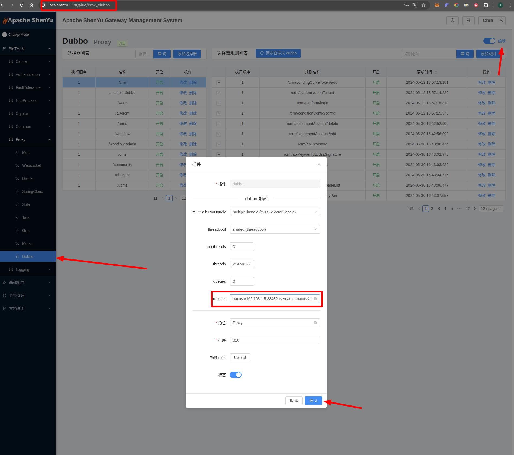
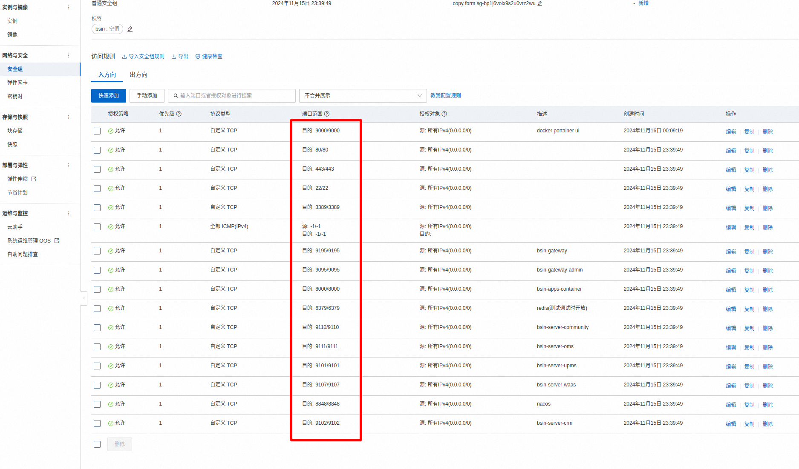

# bsin-paas-os docker 启动说明

## 安装命令行工具
oh-my-zsh

## 准备环境
1. 安装docker
~~~bash
# ubuntu
sudo apt-get install -y docker
~$ docker -v
Docker version 23.0.6, build ef23cbc

# centos

# [Alibaba Cloud Linux 3.2104 LTS 64](https://www.cnblogs.com/del-x/p/18418824)


问题说明：
1、 Package 'docker' has no installation candidate 需要更新软件源: 阿里云镜像源

依次再执行以下命令：
#阿里云镜像源
curl -fsSL https://mirrors.aliyun.com/docker-ce/linux/ubuntu/gpg | sudo gpg --dearmor -o /etc/apt/keyrings/docker.gpg
 
#官方网站
curl -fsSL https://download.docker.com/linux/ubuntu/gpg | sudo gpg --dearmor -o /etc/apt/keyrings/docker.gpg

sudo apt update

~~~
2. 安装docker-compose
~~~bash
# 下载2.25版本的只有2.20版本以上支持include特性
sudo curl -L "https://github.com/docker/compose/releases/download/v2.25.0/docker-compose-$(uname -s)-$(uname -m)" -o /usr/local/bin/docker-compose

# 授权可执行
sudo chmod +x /usr/local/bin/docker-compose

# 查看版本号
docker-compose --version
Docker Compose version v2.25.0

# 卸载
sudo rm /usr/local/bin/docker-compose

# 指定文件启动
docker-compose -f docker-compose.yml up -d

# 查看运行中的容器
docker-compose ps

# 停止容器而不删除
docker-compose stop

# 停止并删除正在运行的容器
docker-compose down

问题说明：
网络访问配置
配置host可以访问github

~~~

## 上传编译号的部署文件到指定目录
1、新进服务器目录
```json
mkdir bsin-paas-os
```

```json
sh upload.sh root@47.105.xx.xxx
```

## 修改docker镜像IP
nginx镜像配置: 如果不需要域名访问，则不需要配置，注释掉deploy.sh脚本里面得bsin-nginx

/docker/middleware/nginx/conf/nginx.conf


## 修改完配置文件上传
.env配置文件

上传到bsin-paas-os目录


## bsin-paas-os docker 镜像构建
~~~bash
# 1.前后端程序打包 Usage: Usage: sh package.sh [server_apps|ui_apps|all]
# 1.1、打包前端程序
bash ./script/package.sh ui_apps
# 1.2、打包后端端程序
# 打包前记得将配置文件修改为正确的mysql、redis、nacos地址，IP地址需要和主机地址(云服务器就是公网地址)一致
bash ./script/package.sh server_apps
# 一键打包前后端程序
bash ./script/package.sh all

# 2.bsin-paas-os程序拷贝、镜像构建和启动 Usage: sh deploy.sh [build|middleware|gateway|server_apps|ui_apps|start|stop|rm|clean|copy|ai_agent|upms|waas|crm|brms|search|workflow|workflow_admin]
# 一键拷贝打包好的程序包到对应镜像构建目录
bash ./script/deploy.sh copy
# 一键构建前后端程序镜像
bash ./script/deploy.sh build
# 一键启动是所有容器
bash ./script/deploy.sh start
# 一键停止是所有容器
bash ./script/deploy.sh stop
~~~

- 容器启动成功后，访问地址：http://localhost:8000


## docker ui 服务(optional)
~~~bash
# 启动 portainer
docker-compose -f portainer.yml up -d
~~~
- 访问地址：http://localhost:9000


## FAQ
- 1.镜像构建失败
* [尝试设置 docker 代理](https://cloud-atlas.readthedocs.io/zh-cn/latest/docker/network/docker_proxy_quickstart.html)

- 2.镜像pull失败
~~~bash
# 将其镜像地址进行替换
vim /etc/docker/daemon.json
# 添加镜像加速器
{
 "data-root": "/var/lib/docker",
 "experimental": true,
 "fixed-cidr-v6": "fc00:1010:1111:100::/64",
 "ip6tables": true,
 "ipv6": true,
 "live-restore": true,
 "log-driver": "json-file",
 "log-opts": {
  "max-file": "3",
  "max-size": "10m"
 },
 "registry-mirrors": [
    "https://docker.1panel.live",
    "https://docker.m.daocloud.io",
    "https://hub.uuuadc.top",
    "https://docker.anyhub.us.kg",
    "https://docker.chenby.cn",
    "https://dockerhub.jobcher.com",
    "https://dockerhub.icu",
    "https://docker.ckyl.me",
    "https://docker.awsl9527.cn",
    "https://docker.hpcloud.cloud",
    "https://atomhub.openatom.cn",
    "https://hub.docker.com"
 ],
  "exec-opts": [
    "native.cgroupdriver=systemd"
  ]
}
# 重启docker服务
systemctl daemon-reload
systemctl restart docker
~~~

- 3.tager-gateway 容器启动失败
* 检查网关配置文件 [application.yml](../bsin-targe-gateway/src/main/resources/application.yml) 中 nacos 地址配置是否正确，修改为你当前启动**bsin-nacos-standalone**容器再主机的ipv4地址
* 检查shenyu网关后台配置, 【插件列表】【Proxy】【Dubbo】【编辑】【register】 是否配置为 nacos 地址



- 4.同理，其他容器启动失败，需先仔细检查配置文件，如 nacos、网关、mysql数据库、redis数据库地址和端口，shenyu 用户名和密码，数据库用户名和密码等是否正确，总之要检查你的配置文件是否正确。

- 5. 若使用云服务器 http://ip:8000 无法访问，请记得开发你的安全组,，根据情况开放相应的端口



备注：

需要开放服务器端口


| 端口          |      服务名称 |
|:------------|----------:|
| 8000        |    基座访问地址 | 
| 9195        |      网关服务 |  
| 554         |    RTSP协议 | 
| 1935        |      RTMP |  
| 8865        | easymedia |  
