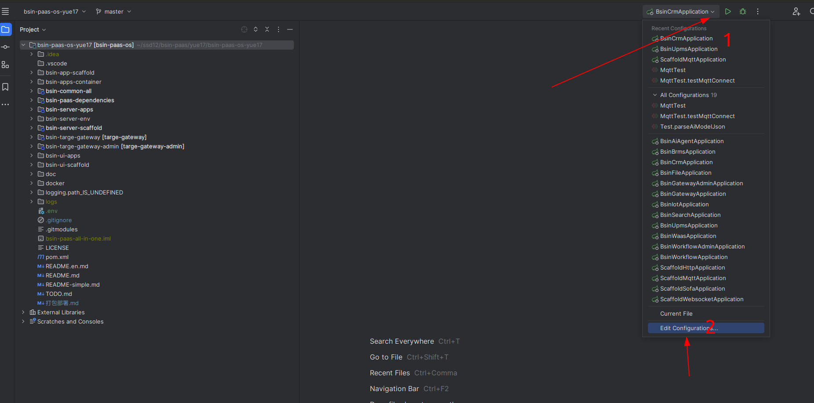
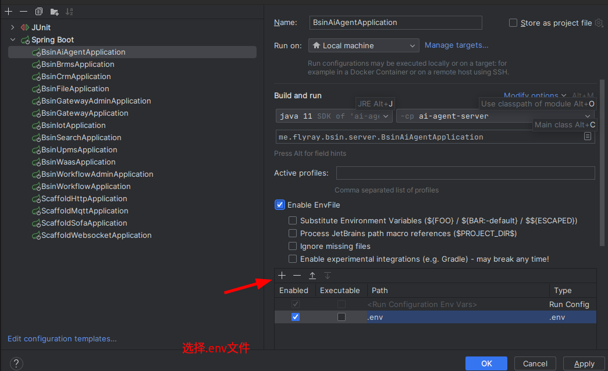

## 打包部署

mvn clean package -Dcheckstyle.skip=true -Dmaven.test.skip=true -Drat.skip=true -Denforcer.skip=true -Dmaven.javadoc.skip=true -Pdist,embedded-hbase-solr

## nacos启动

startup.cmd -m standalone

## 环境变量
### idea环境变量使用
- 安装EnvFile插件
1. 打开 IDEA，进入 File → Settings → Plugins。  
2. 搜索并安装 EnvFile 插件，重启 IDEA。

- 将 .env 绑定到运行配置
1. 打开 Run/Debug Configurations（右上角运行按钮旁的下拉菜单）。
2. 选择你的运行配置（如 Spring Boot、Python 等），找到 EnvFile 标签。
3. 勾选 Enable EnvFile，点击 + 添加 .env 文件路径（如 $PROJECT_DIR$/.env）
4. 
5. 